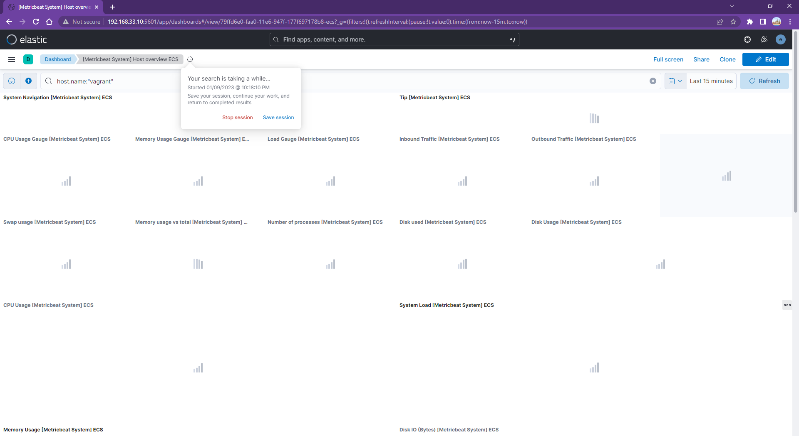

# Lab 001: ELK Monitoring

Windows + Ubuntu (vagrant vbox)

## Steps

### 1. Deploy the ELK stack

Clone the github repo and run the docker compose to start up the ELK stack

```bash
sudo sysctl -w vm.max_map_count=262144

git clone https://github.com/briansu2004/udemy-devops-9projects-free.git
cd udemy-devops-9projects-free/001-ELKMonitoring

# passwords are in the .env file

docker compose up
```

### 2. Add Elasticsearch CA certificates

As the communication between Elasticsearch and metricbeat is using tls, we need to add the Elasticsearch CA into the server which is going to be monitored.

a. Copy the CA certificate from one of Elasticsearch containers

```bash
docker exec -it $(docker ps -aqf "name=001-elkmonitoring-es01-1") openssl x509 -fingerprint -sha256 -in /usr/share/elasticsearch/config/certs/ca/ca.crt

```

The output will be used in the next step.

e.g.

```dos
-----BEGIN CERTIFICATE-----
MIIDSTCCAjGgAwIBAgIUIE9X/EuZELkpT+TXfJOwXWIfiOgwDQYJKoZIhvcNAQEL
BQAwNDEyMDAGA1UEAxMpRWxhc3RpYyBDZXJ0aWZpY2F0ZSBUb29sIEF1dG9nZW5l
cmF0ZWQgQ0EwHhcNMjMwMTIyMTQzMTQ0WhcNMjYwMTIxMTQzMTQ0WjA0MTIwMAYD
VQQDEylFbGFzdGljIENlcnRpZmljYXRlIFRvb2wgQXV0b2dlbmVyYXRlZCBDQTCC
ASIwDQYJKoZIhvcNAQEBBQADggEPADCCAQoCggEBAOO4ely8bkxYxrNXqapboCXY
LKvfZuRHY4H7TqnlkIKHrfAQgUf1nBy8fmrj+pNdORkT46u7abK+do/8H/1yqDFW
KmkalRDoVgQxRynUDlzDToXb9a0gjd9WitJW+pdpzHnwjK7k80LNpNiYTBjr0ngZ
6aCCYLbrSHkUn+OituntoWyPA56AWpt1Mb9ZgZRSbhZp/w7onyZBXuFBqgaK3IBw
/LJrYaWB7CjfJyX57JE7wHBgLa+Pzbrwnvr61wAlpQzwNhFMQxUOwv6WQZMCaqwZ
PHbrgTsbHE7NgWKYVFivnNvDqpbVCQPSl2eAThz9xivJDxkVDvp2AOTscQBbyREC
AwEAAaNTMFEwHQYDVR0OBBYEFG4gzGCp3Gg5MukNLl+Dc/KkENyCMB8GA1UdIwQY
MBaAFG4gzGCp3Gg5MukNLl+Dc/KkENyCMA8GA1UdEwEB/wQFMAMBAf8wDQYJKoZI
hvcNAQELBQADggEBALHBlRP4B+lcBlTVjFf675UhaSsONoWZFC1p8FhITSDFLymH
CiK7XpFOiYD8obiTgXDCZOQ3t4VU8ZiR+9hinxPzvHoS5t2WZ7bTRTq2JDO+/u1y
wliF6N1WGSbgRzgmrjcpYgo3LorbK2PboBgDNJj3PkGguHd0mCMvEic7epiBR1SR
09NmtCOu5o6oUCV5j/WWTlShAqVNWhgE6js1RKqcBhkvU0XXd7Yl91rn3o1v9rIB
Q59p5vi1+r5Jjm1WHsPHnnIdjJXqk1aTVyqWDrIhtv1/xphzLppqjv7K7q0m8+17
YODMWORSi2eVcBZjVWHi88wdAZHKbVGLBe+dIqk=
-----END CERTIFICATE-----
```

b. Run below command:

<!-- Go to the local host which we want to monitor -->
<!-- In Vagrant Ubuntu -->

```bash
sudo apt-get install -y ca-certificates
cd /usr/local/share/ca-certificates/
sudo vim elasticsearch-ca.crt
# Paste the CA certificate we copied in above step and then run below command to add it to the host
cat /usr/local/share/ca-certificates/elasticsearch-ca.crt

sudo update-ca-certificates
```

### 3. Deploy metricbeat service

Deploy a metricbeat service in the monitored server to collect the metric data.

> Note: In this example, we are monitoring the local host. For other hosts, we just need to update the ELK host IP address in the `metricbeat.yaml` to make sure the metricbeat can reach the Elasticsearch.

```dos
wget -qO - https://artifacts.elastic.co/GPG-KEY-elasticsearch | sudo apt-key add -

echo "deb https://artifacts.elastic.co/packages/7.x/apt stable main" | sudo tee -a /etc/apt/sources.list.d/elastic-7.x.list

sudo apt update
sudo apt install metricbeat

sudo vim /etc/metricbeat/metricbeat.yml
```

Note: Make sure below section is updated in `metricbeat.yml`

```dos
setup.kibana:
  host: "localhost:5601"

output.elasticsearch:
  hosts: ["localhost:9200"]
  #protocol: "https"
  #username: "elastic"
  #password: "changeme"
```

->

```dos
setup.kibana:
  host: "127.0.0.1:5601"

output.elasticsearch:
  hosts: ["127.0.0.1:9200"]
  protocol: "https"
  username: "elastic"
  password: "Password!2023"
```

```dos
sudo metricbeat setup -e

sudo systemctl start metricbeat

sudo systemctl status metricbeat
```

<!--
# sudo systemctl restart metricbeat
# sudo systemctl stop metricbeat

# if we are in wsl use following command
#
# sudo service metricbeat stop
# sudo service metricbeat start
# sudo service metricbeat restart
# sudo service metricbeat status
#
# sudo service --status-all

```dos
vagrant@vagrant:~$ sudo service --status-all
 [ + ]  apparmor
 [ - ]  console-setup.sh
 [ + ]  cron
 [ - ]  cryptdisks
 [ - ]  cryptdisks-early
 [ + ]  dbus
 [ + ]  docker
 [ - ]  grub-common
 [ - ]  hwclock.sh
 [ - ]  irqbalance
 [ - ]  keyboard-setup.sh
 [ + ]  kmod
 [ - ]  lvm2
 [ - ]  lvm2-lvmpolld
 [ + ]  metricbeat
 [ - ]  nfs-common
 [ + ]  nfs-kernel-server
 [ - ]  plymouth
 [ - ]  plymouth-log
 [ + ]  procps
 [ + ]  rpcbind
 [ - ]  rsync
 [ + ]  rsyslog
 [ + ]  ssh
 [ + ]  udev
 [ + ]  ufw
 [ + ]  unattended-upgrades
 [ - ]  uuidd
```
-->

<!--
For the error:

```dos
2023-01-22T15:12:38.560Z        ERROR   [esclientleg]   transport/logging.go:37 Error dialing EOF       {"network": "tcp", "address": "127.0.0.1:9200"}
2023-01-22T15:12:38.561Z        ERROR   [esclientleg]   eslegclient/connection.go:232   error connecting to Elasticsearch at https://127.0.0.1:9200: Get "https://127.0.0.1:9200": EOF
2023-01-22T15:12:38.561Z        ERROR   instance/beat.go:1026   Exiting: couldn't connect to any of the configured Elasticsearch hosts. Errors: [error connecting to Elasticsearch at https://127.0.0.1:9200: Get "https://127.0.0.1:9200": EOF]
Exiting: couldn't connect to any of the configured Elasticsearch hosts. Errors: [error connecting to Elasticsearch at https://127.0.0.1:9200: Get "https://127.0.0.1:9200": EOF]
```

Wait a few minutes then re-run `sudo metricbeat setup -e` command.
-->

### 4. Go to Kibana. In Dashboard, select "[Metricbeat System] Host overview ECS"

a. Open the browser and go to [http://192.168.33.10:5601/](http://192.168.33.10:5601/).

Enter the username (default is elastic) / password set in `.env`.

b. Click the menu icon in the top left and go to "Dashboard"

c. Select "[Metricbeat System] Host overview ECS" and we should be able to see all metric data from the local host presented in the dashboard.


