# Lab 002: Jenkins CICD Pipeline

Windows only

Works

## Steps

### 1. Deploy a Jenkins docker container with **docker compose**

```bash
git clone https://github.com/briansu2004/udemy-devops-9projects-free.git
cd udemy-devops-9projects-free/002-JenkinsCICD
docker compose up -d
```

### 2. Open our **browser** and go to the Jenkins UI website (<http://<JenkinsHostIP>>)

If we install the Jenkins in our local host, we can go [http://127.0.0.1](http://127.0.0.1) or [http://0.0.0.0](http://0.0.0.0).

Login to the Jenkins with the username/password defined in our `docker-compose.yaml`.

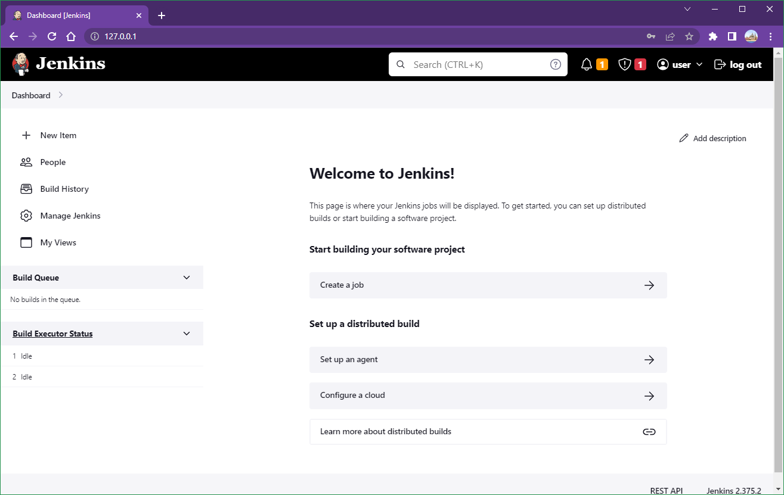

### 3. Go to **"Manage Jenkins"** in the left lane and go to **"Manage Plugins"**. Click **"Available"** tab in the **"Plugin Manager"** page and type **"pipeline"** in the search bar. Select **"Pipeline"** and click **"Download now and install after restart"**

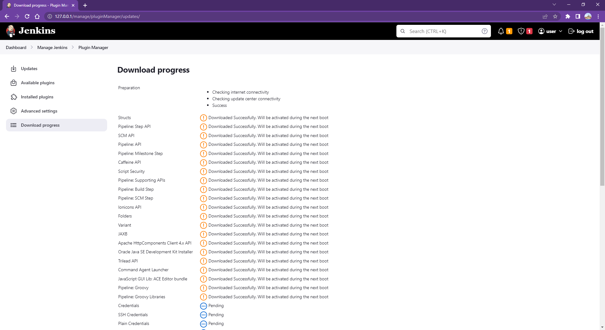

### 4. Follow the same step above and install **"git"** and **"Docker Pipeline"** as plugins

### 5. Once the plugin is installed and the Jenkins is restarted, go to the main page of the Jenkins website and click **"New Item"** in the left. Type the name of our project (i.g. first-project) and select **"Pipeline"** and click **"OK"**. In the Configuration page, make sure below fields in **"Pipeline"** section are filled

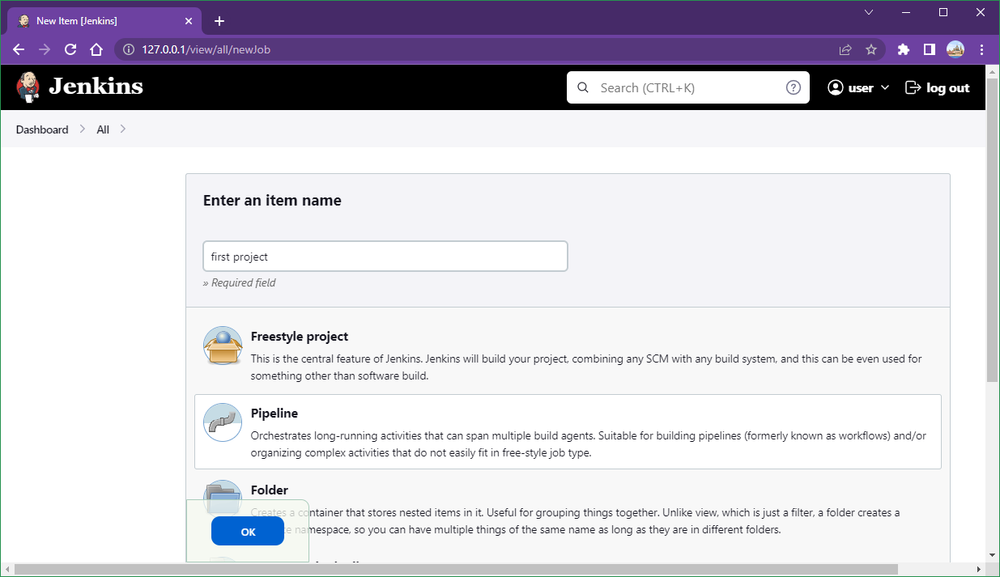

a. **"Definition"**: select "Pipeline script from SCM"

b. **"SCM"**: select "Git"

c. **"Repository URL"**: Enter the URL of the repo which has Jenkinsfile, for example, <https://github.com/briansu2004/udemy-devops-9projects-free>. (Note: You can fork "udemy-devops-9projects-free" repo to our github account and enter the URL accordingly)

d. **"Credentials"**: If we don't have any credential, click "Add" -> "Jenkins", in "Kind" field select "Username with password". In "Scope" field select "Global(Jenkins, nodes, items, all child items, etc)". In "Username", type our github account username. In "Password", type our github account token.

**Note**: In order to get a github token, we can go to our github account and select **"Setting"** once we click our account icon in the top right. Go to **"Developer settings"** in the very bottom left lane and go to **"Personal access tokens"** -> **"Tokens(classic)"**, and then click "Generate new token" to create a new token for above step, making sure the token has at lease `write:packages` and `read:packages` so that it can upload/download packages to GitHub Package Registry.

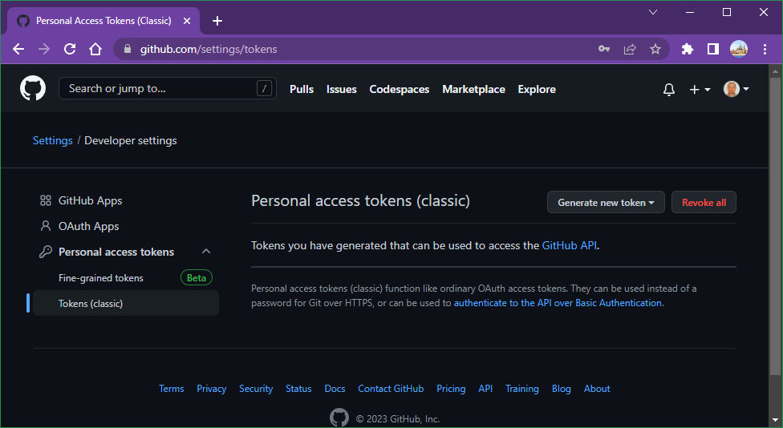

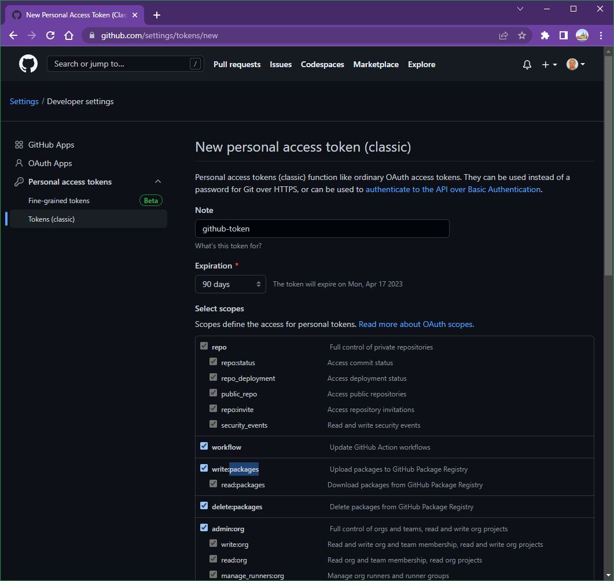

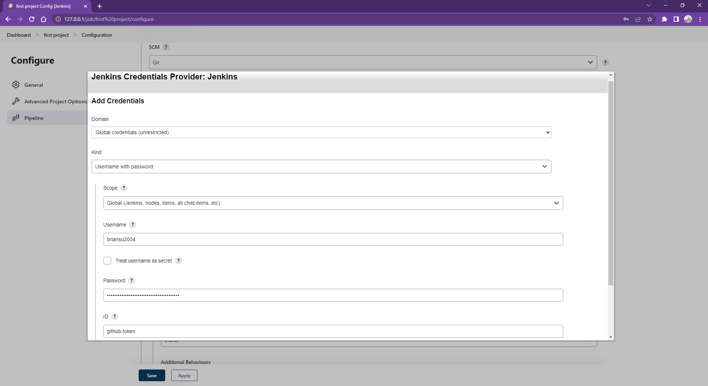

e. **"ID"**: Enter the name of this credential, which will be referred in the Pipeline later. For example, github-token.

f. **"Branch Specifier (blank for 'any')"**: Enter the branch which has our Jenkinsfile, for example, `*/main`

g. **"Script Path"**: Enter the relative path for the Jenkinsfile in our repo, for example, 002-JenkinsCICD/Jenkinsfile

h. Unselect **"Lightweight checkout"**

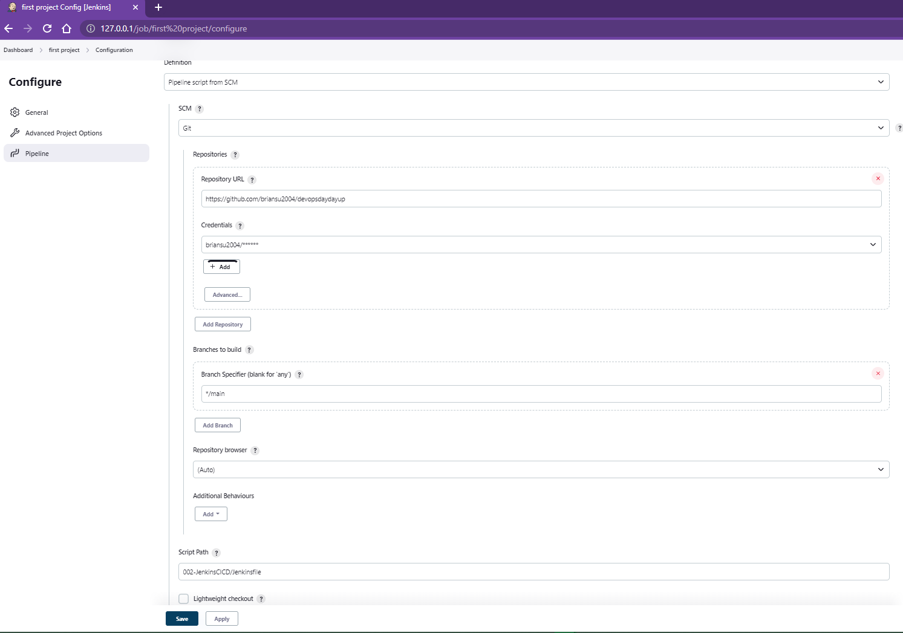

Save above change.

### 6. Run a container **before** trigger our pipeline

```bash
docker build -t color-web:init .
docker run -d -p 8080:8080 --name color-web color-web:init
```

```bash
docker ps -aqf "name=002-jenkinscicd-jenkins-1"

docker exec <jenkins_container> chmod 777 /var/run/docker.sock
```

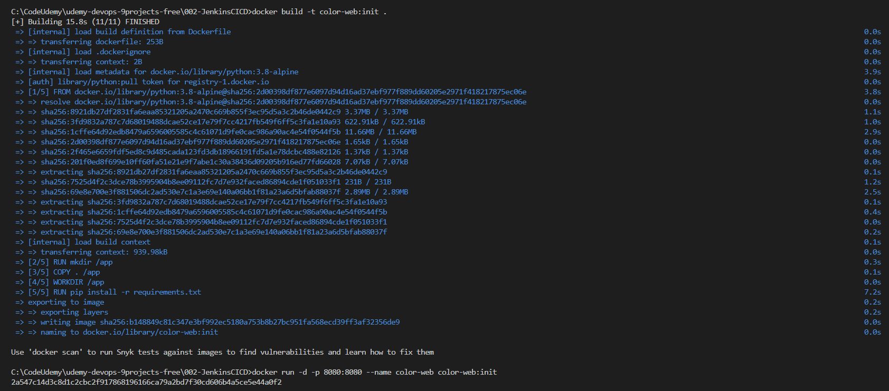

### 7. Click **"Build"** to trigger our first pipeline

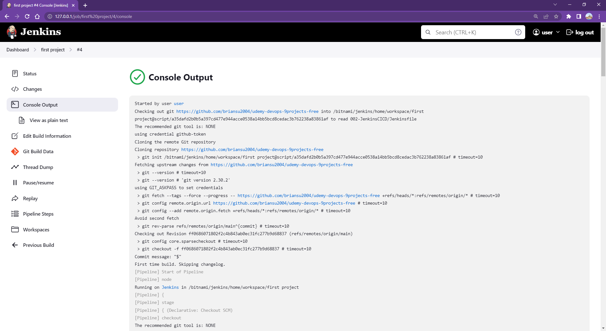

### 8. You should be able to see the hello world page in [http://localhost:8080](http://localhost:8080)

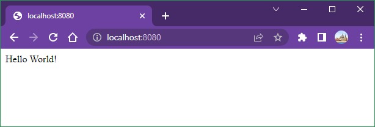

### 9. Make a change into `app.py`

For example, change "Hello world" to "Hello DevOps".

```python
def hello():
    return "Hello DevOps!"
```

Then git push to the repo.

And then click "Build" again to trigger the pipeline to deploy the change.

 Once it is done, we should be able to see our change in [http://localhost:8080](http://localhost:8080)

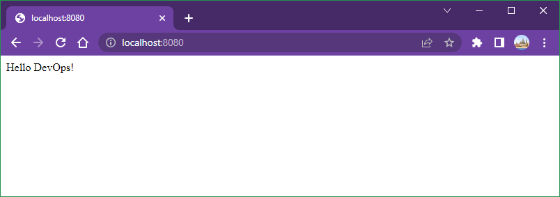
