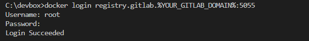
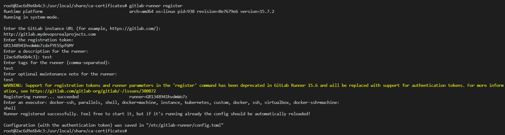
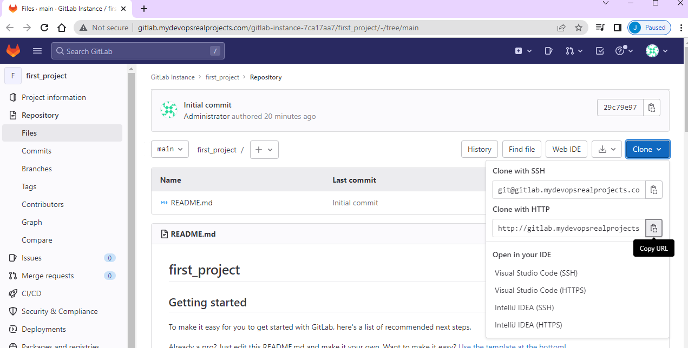
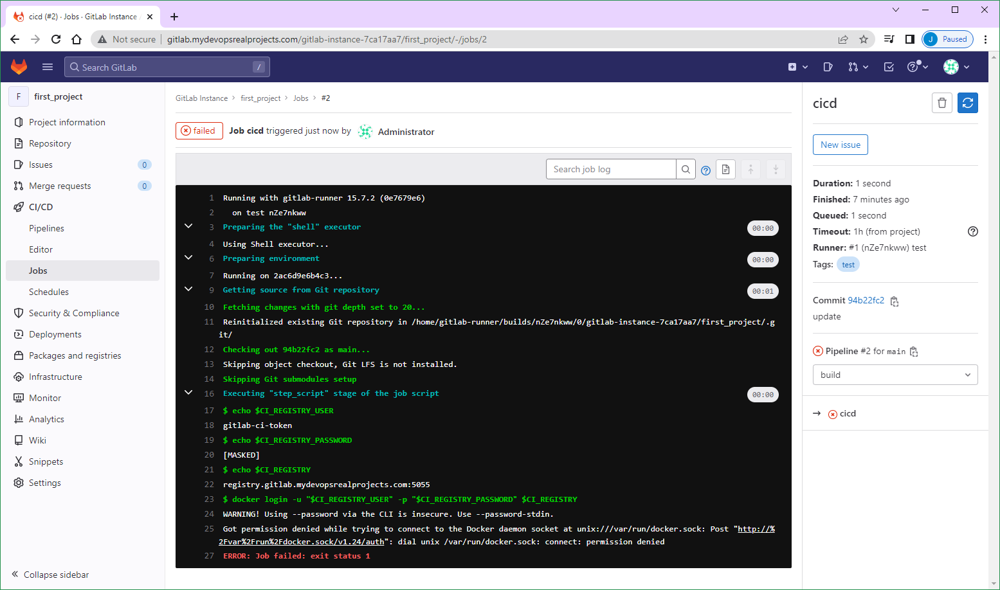

# Project 003: Gitlab CICD Pipeline

Windows only

Works

## Steps

## 1. Config the gitlab_domain_name

In this lab, we will use `mydevopsrealprojects.com` as the gitlab_domain_name.

Hence the gitlab instance URL is `http://gitlab.mydevopsrealprojects.com`

`docker-compose.yml`

## 2. Configure the **hosts** file

Windows: `C:\Windows\System32\drivers\etc\hosts`

In local Windows's hosts file `C:\Windows\System32\drivers\etc\hosts`

```dos
192.168.33.10 gitlab.mydevopsrealprojects.com
192.168.33.10 registry.gitlab.mydevopsrealprojects.com
```

Unix / Mac: `/etc/hosts`

In Vagrant Ubuntu's hosts file `/etc/hosts`

```bash
127.0.0.1 gitlab.mydevopsrealprojects.com
127.0.0.1 registry.gitlab.mydevopsrealprojects.com
```

## 3. Config the root password

```yml
    hostname: 'gitlab.mydevopsrealprojects.com'
    environment:
      GITLAB_ROOT_PASSWORD: "Password2023#"
      EXTERNAL_URL: "http://gitlab.mydevopsrealprojects.com"
      GITLAB_OMNIBUS_CONFIG: |
        gitlab_rails['initial_root_password'] = "Password2023#"
```

## 4. Docker compose

<!--
Docker login with the GitHub token

```dos
docker login ghcr.io -u briansu2004
```

Docker compose
-->

```dos
git clone https://github.com/briansu2004/udemy-devops-9projects-free.git
cd udemy-devops-9projects-free/003-GitlabCICD
docker compose up
```

Note: these container IDs will be used in many of the following steps.

```dos
C:\CodeUdemy\udemy-devops-9projects-free\003-GitlabCICD>docker ps -f name=web -q
79de446cca8c

C:\CodeUdemy\udemy-devops-9projects-free\003-GitlabCICD>docker ps -f name=runner -q 
2ac6d9e6b4c3
```

## 5. Login to the GitLab

May have to wait for about **5 ~ 10 minutes** for the server to fully start up.

Then go to [http://gitlab.mydevopsrealprojects.com](http://gitlab.mydevopsrealprojects.com) and login the username `root` and the password `Password2023#`.

## 6. Get the GitLab registration token

Click **"New project"** to create your first project

-> Click **"Create blank project"**

-> Type your project name in **"Project Name"**

-> Select **"Public"**

-> Click **"Create project"**

-> Go to the new project you just created, and **"Setting"** -> **"CI/CD"**

-> Expand **"Runners"** section.

-> **Make a note** of **"URL** and **registration token** in **"Specific runners"** section for below runner installation used.


We need to use the URL `http://gitlab.mydevopsrealprojects.com/` and the registration token to Register the runner.

<!-- GR1348941hvdmWo7zdxfYESSpf6MY -->

## 7. Update the certificates

Since the initial Gitlab server **certificate** is missing some info and can't be used by the gitlab runner, we may have to **regenerate** a new one and **reconfigure** in the gitlab server.

```dos
docker exec -it 79de446cca8c bash
mkdir /etc/gitlab/ssl
cd /etc/gitlab/ssl
openssl genrsa -out ca.key 2048
openssl req -new -x509 -days 365 -key ca.key -subj "/C=CN/ST=GD/L=SZ/O=Acme, Inc./CN=Acme Root CA" -out ca.crt
export YOUR_GITLAB_DOMAIN=mydevopsrealprojects.com
echo $YOUR_GITLAB_DOMAIN
openssl req -newkey rsa:2048 -nodes -keyout gitlab.$YOUR_GITLAB_DOMAIN.key -subj "/C=CN/ST=GD/L=SZ/O=Acme, Inc./CN=*.$YOUR_GITLAB_DOMAIN" -out gitlab.$YOUR_GITLAB_DOMAIN.csr
openssl x509 -req -extfile <(printf "subjectAltName=DNS:$YOUR_GITLAB_DOMAIN,DNS:gitlab.$YOUR_GITLAB_DOMAIN") -days 365 -in gitlab.$YOUR_GITLAB_DOMAIN.csr -CA ca.crt -CAkey ca.key -CAcreateserial -out gitlab.$YOUR_GITLAB_DOMAIN.crt
ls -l
```

Certificate for nginx (container registry)

```dos
openssl req -newkey rsa:2048 -nodes -keyout registry.gitlab.$YOUR_GITLAB_DOMAIN.key -subj "/C=CN/ST=GD/L=SZ/O=Acme, Inc./CN=*.$YOUR_GITLAB_DOMAIN" -out registry.gitlab.$YOUR_GITLAB_DOMAIN.csr
openssl x509 -req -extfile <(printf "subjectAltName=DNS:$YOUR_GITLAB_DOMAIN,DNS:gitlab.$YOUR_GITLAB_DOMAIN,DNS:registry.gitlab.$YOUR_GITLAB_DOMAIN") -days 365 -in registry.gitlab.$YOUR_GITLAB_DOMAIN.csr -CA ca.crt -CAkey ca.key -CAcreateserial -out registry.gitlab.$YOUR_GITLAB_DOMAIN.crt
ls -l
cat gitlab.$YOUR_GITLAB_DOMAIN.crt
cat registry.gitlab.$YOUR_GITLAB_DOMAIN.crt
exit
```

e.g.

```bash
root@gitlab:/etc/gitlab/ssl# cat gitlab.$YOUR_GITLAB_DOMAIN.crt
-----BEGIN CERTIFICATE-----
MIIDijCCAnKgAwIBAgIUQE8oT0hQxDYuC4PsIXb3CBKN9UEwDQYJKoZIhvcNAQEL
BQAwUzELMAkGA1UEBhMCQ04xCzAJBgNVBAgMAkdEMQswCQYDVQQHDAJTWjETMBEG
A1UECgwKQWNtZSwgSW5jLjEVMBMGA1UEAwwMQWNtZSBSb290IENBMB4XDTIzMDEy
MjAxMTEwMFoXDTI0MDEyMjAxMTEwMFowYTELMAkGA1UEBhMCQ04xCzAJBgNVBAgM
AkdEMQswCQYDVQQHDAJTWjETMBEGA1UECgwKQWNtZSwgSW5jLjEjMCEGA1UEAwwa
Ki5teWRldm9wc3JlYWxwcm9qZWN0cy5jb20wggEiMA0GCSqGSIb3DQEBAQUAA4IB
DwAwggEKAoIBAQDcqT1Jo1igGYbifLdI2/oijrSoogsPT6B3NJ65Wqegs62W3139
dSoOX0xbnoiO6RaxAoqqiEAh8g+VDgODpUlRoxUQ736SfDtlE7UNZ1Osx6Jlxf/+
L5Pk1r3u+hOkDGvnXjB+rmF5JAA3Em/xQwnrwyM6q2vtm5OMxckaRbQ2f8MirZNd
QycPCwL3b7N5sh7OqS+dWDuQnes6AqhMJS6T3EMNykblWUlNQtJlSPHGsq6GRD3v
iyapJ4qjcTl7cEKeg1m/6vUWjjWczNL/Grm+/vSmZinT6+sHgMs6GCUS7cF7tIIx
aNvr+zQyhfwlaX7+lEkhVSsPMjYCe/1EwRCrAgMBAAGjSDBGMEQGA1UdEQQ9MDuC
GG15ZGV2b3BzcmVhbHByb2plY3RzLmNvbYIfZ2l0bGFiLm15ZGV2b3BzcmVhbHBy
b2plY3RzLmNvbTANBgkqhkiG9w0BAQsFAAOCAQEAEuQPA0KNcSZLO93mUah4PFdS
PpsVAUkyLiMSg+oiineXulPUqWs0rTb47rx53Js75syQLzih4qGt1w/VQOn65NSm
AQFjWGSLVZRqEFI+vzTVsz3+IPTTJFEK1gkwmtyeiXE52usPHa/Z73CVd814pBl3
qRX1T/QH1ul0XiL+1sswFnp1KEm6177mXTfyzY4VK2+8XKYH+5es4xHOmLGkw7a1
5nEcUJaxviBG2pxqeTOx1SQNcy44NGQoReRxxEDOpXOkoNiGWtVE/fZEK58SoumD
ODl+o4Q+XS6mdZXinOpVXUj8I+g2QZfTo7MIqK/bAG4oF9ZZWZwiEVqEMPkisw==
-----END CERTIFICATE-----

root@gitlab:/etc/gitlab/ssl# cat registry.gitlab.$YOUR_GITLAB_DOMAIN.crt
-----BEGIN CERTIFICATE-----
MIIDtDCCApygAwIBAgIUQE8oT0hQxDYuC4PsIXb3CBKN9UIwDQYJKoZIhvcNAQEL
BQAwUzELMAkGA1UEBhMCQ04xCzAJBgNVBAgMAkdEMQswCQYDVQQHDAJTWjETMBEG
A1UECgwKQWNtZSwgSW5jLjEVMBMGA1UEAwwMQWNtZSBSb290IENBMB4XDTIzMDEy
MjAxMTExMloXDTI0MDEyMjAxMTExMlowYTELMAkGA1UEBhMCQ04xCzAJBgNVBAgM
AkdEMQswCQYDVQQHDAJTWjETMBEGA1UECgwKQWNtZSwgSW5jLjEjMCEGA1UEAwwa
Ki5teWRldm9wc3JlYWxwcm9qZWN0cy5jb20wggEiMA0GCSqGSIb3DQEBAQUAA4IB
DwAwggEKAoIBAQDGmrKo5Tvdok9lYoFKfbLGGwsfpzoKoXiMWjuFRnV/INDLR/cF
oKJ7K+p7Plr5erGrYvbLvOnhTBP1aepXgbh3pZv+n0npr2j2T8jKs1vqekR5SOvT
fJDDlCYNYVph+kyQiIebC9vZppG6diudFLP3xJVfie1IMeqDAMlVN235CFBw5ImC
gLOn3xNqGsMW/DGfYpNn45n9pQ1tnOoOQk10RcLP1gweqg8P4qKIB0sWAZyeJ69x
OMBgm24fQcrWKWljGEl+qmqdfulgJpsu5gXgboLo9+tuK47OlWOpGpIhleiI0TrL
cjVI77pLINKgQhJZePGZYeFFfTtG6KQYwBPXAgMBAAGjcjBwMG4GA1UdEQRnMGWC
GG15ZGV2b3BzcmVhbHByb2plY3RzLmNvbYIfZ2l0bGFiLm15ZGV2b3BzcmVhbHBy
b2plY3RzLmNvbYIocmVnaXN0cnkuZ2l0bGFiLm15ZGV2b3BzcmVhbHByb2plY3Rz
LmNvbTANBgkqhkiG9w0BAQsFAAOCAQEAdcOswDQKCN01fXli4pRpaz/Enlig0Tey
72DitjDjieTOmTft40vEbk+7GyejkSTwDwmeQvF9K1tHPL1YO+DiCxlw7Lm1UL5U
SjG9+c0fJP7YNJFVYpshYM+N15J5XvcWFnE50S2VXLHnXZmUGra4IGx4mIQRsd8j
v2DaJUNQusLvOXoJJc5woo3gm1Yk5lG53gRmQWBQFbRRMfZXnEcG9oTNT5p2yhHP
2iAKR+ngyV+O9v+/u56uyganJLzovvErQ2YzwqpBrzykemkTwF7VHTPc9jyCnnbK
dsGl2GpZ5ZUzRDRGkLkxKLX0tXne9+N1/+ZizRCg1dc3CVrEoCvqFg==
-----END CERTIFICATE-----
```

## 8. Enable the container register

Add below lines in the bottom of the file `/etc/gitlab/gitlab.rb`.

```dos
docker exec -it 79de446cca8c bash

cat >> /etc/gitlab/gitlab.rb <<EOF

 registry_external_url 'https://registry.gitlab.$YOUR_GITLAB_DOMAIN:5055'  # Note: for Windows
 gitlab_rails['registry_enabled'] = true
 gitlab_rails['registry_host'] = "registry.gitlab.$YOUR_GITLAB_DOMAIN"
 gitlab_rails['registry_port'] = "5005"
 gitlab_rails['registry_path'] = "/var/opt/gitlab/gitlab-rails/shared/registry"
 gitlab_rails['registry_api_url'] = "http://127.0.0.1:5000"
 gitlab_rails['registry_key_path'] = "/var/opt/gitlab/gitlab-rails/certificate.key"
 registry['enable'] = true
 registry['registry_http_addr'] = "127.0.0.1:5000"
 registry['log_directory'] = "/var/log/gitlab/registry"
 registry['env_directory'] = "/opt/gitlab/etc/registry/env"
 registry['env'] = {
   'SSL_CERT_DIR' => "/opt/gitlab/embedded/ssl/certs/"
 }
 # Note: Make sure to update below 'rootcertbundle' default value 'certificate.crt" to 'gitlab-registry.crt', otherwise you may get error.
 registry['rootcertbundle'] = "/var/opt/gitlab/registry/gitlab-registry.crt"
 nginx['ssl_certificate'] = "/etc/gitlab/ssl/registry.gitlab.$YOUR_GITLAB_DOMAIN.crt"
 nginx['ssl_certificate_key'] = "/etc/gitlab/ssl/registry.gitlab.$YOUR_GITLAB_DOMAIN.key"
 registry_nginx['enable'] = true
 registry_nginx['listen_port'] = 5005
EOF
tail -25 /etc/gitlab/gitlab.rb
```

Reconfigure the gitlab to apply above change

```dos
gitlab-ctl reconfigure
gitlab-ctl restart
exit
```

Note: May have to wait for about **5 ~ 10 minutes** for the server to fully start up.

## 9. Docker login

<!-- Update the certificates for the docker client (skip)-->

```dos
set YOUR_GITLAB_DOMAIN=mydevopsrealprojects.com
echo %YOUR_GITLAB_DOMAIN%

# Test docker login and you should be able to login now
docker login registry.gitlab.%YOUR_GITLAB_DOMAIN%:5055
Username: root
Password: Password2023#
Login Succeeded
```



<!--
export YOUR_GITLAB_DOMAIN=mydevopsrealprojects.com
echo $YOUR_GITLAB_DOMAIN
sudo mkdir -p /etc/docker/certs.d/registry.gitlab.$YOUR_GITLAB_DOMAIN:5055
sudo docker cp $(docker ps -f name=web -q):/etc/gitlab/ssl/registry.gitlab.$YOUR_GITLAB_DOMAIN.crt /etc/docker/certs.d/registry.gitlab.$YOUR_GITLAB_DOMAIN:5055/
sudo ls /etc/docker/certs.d/registry.gitlab.$YOUR_GITLAB_DOMAIN:5055
-->

Test if the docker image push works once login successfully -

Login to the gitlab server web UI and go to the project created, and then go to "Packages and registries" -> "Container Registry", should be able to see the valid registry URL you suppose to use in order to build and push your image.


e.g.

```dos
docker build -t registry.gitlab.mydevopsrealprojects.com:5055/gitlab-instance-7ca17aa7/first_project .
```


## 10. Configure the **gitlab-runner**

Login to gitlab-runner and run commands below.

Please note the tag below has to match with the `tags` section in `.gitlab-ci.yml` file:

```yml
  tags:
    - test
```

```dos
export YOUR_GITLAB_DOMAIN=mydevopsrealprojects.com
echo $YOUR_GITLAB_DOMAIN
docker exec 79de446cca8c cat /etc/gitlab/ssl/gitlab.%YOUR_GITLAB_DOMAIN%.crt
docker exec 79de446cca8c cat /etc/gitlab/ssl/registry.gitlab.%YOUR_GITLAB_DOMAIN%.crt

set YOUR_GITLAB_DOMAIN=mydevopsrealprojects.com
echo %YOUR_GITLAB_DOMAIN%

```

```dos
docker exec -it 2ac6d9e6b4c3 bash
cd /usr/local/share/ca-certificates/
ls -l

cat > /usr/local/share/ca-certificates/gitlab-server.crt <<EOF
# <Paste above gitlab server certificate here>
EOF
```

<!--
cat > /usr/local/share/ca-certificates/gitlab-server.crt <<EOF
-----BEGIN CERTIFICATE-----
MIIDijCCAnKgAwIBAgIUQE8oT0hQxDYuC4PsIXb3CBKN9UEwDQYJKoZIhvcNAQEL
BQAwUzELMAkGA1UEBhMCQ04xCzAJBgNVBAgMAkdEMQswCQYDVQQHDAJTWjETMBEG
A1UECgwKQWNtZSwgSW5jLjEVMBMGA1UEAwwMQWNtZSBSb290IENBMB4XDTIzMDEy
MjAxMTEwMFoXDTI0MDEyMjAxMTEwMFowYTELMAkGA1UEBhMCQ04xCzAJBgNVBAgM
AkdEMQswCQYDVQQHDAJTWjETMBEGA1UECgwKQWNtZSwgSW5jLjEjMCEGA1UEAwwa
Ki5teWRldm9wc3JlYWxwcm9qZWN0cy5jb20wggEiMA0GCSqGSIb3DQEBAQUAA4IB
DwAwggEKAoIBAQDcqT1Jo1igGYbifLdI2/oijrSoogsPT6B3NJ65Wqegs62W3139
dSoOX0xbnoiO6RaxAoqqiEAh8g+VDgODpUlRoxUQ736SfDtlE7UNZ1Osx6Jlxf/+
L5Pk1r3u+hOkDGvnXjB+rmF5JAA3Em/xQwnrwyM6q2vtm5OMxckaRbQ2f8MirZNd
QycPCwL3b7N5sh7OqS+dWDuQnes6AqhMJS6T3EMNykblWUlNQtJlSPHGsq6GRD3v
iyapJ4qjcTl7cEKeg1m/6vUWjjWczNL/Grm+/vSmZinT6+sHgMs6GCUS7cF7tIIx
aNvr+zQyhfwlaX7+lEkhVSsPMjYCe/1EwRCrAgMBAAGjSDBGMEQGA1UdEQQ9MDuC
GG15ZGV2b3BzcmVhbHByb2plY3RzLmNvbYIfZ2l0bGFiLm15ZGV2b3BzcmVhbHBy
b2plY3RzLmNvbTANBgkqhkiG9w0BAQsFAAOCAQEAEuQPA0KNcSZLO93mUah4PFdS
PpsVAUkyLiMSg+oiineXulPUqWs0rTb47rx53Js75syQLzih4qGt1w/VQOn65NSm
AQFjWGSLVZRqEFI+vzTVsz3+IPTTJFEK1gkwmtyeiXE52usPHa/Z73CVd814pBl3
qRX1T/QH1ul0XiL+1sswFnp1KEm6177mXTfyzY4VK2+8XKYH+5es4xHOmLGkw7a1
5nEcUJaxviBG2pxqeTOx1SQNcy44NGQoReRxxEDOpXOkoNiGWtVE/fZEK58SoumD
ODl+o4Q+XS6mdZXinOpVXUj8I+g2QZfTo7MIqK/bAG4oF9ZZWZwiEVqEMPkisw==
-----END CERTIFICATE-----
EOF
-->

```dos
cat > /usr/local/share/ca-certificates/registry.gitlab-server.crt <<EOF
# <Paste above gitlab registry certificate here>
EOF
```

<!--
cat > /usr/local/share/ca-certificates/registry.gitlab-server.crt <<EOF
-----BEGIN CERTIFICATE-----
MIIDtDCCApygAwIBAgIUQE8oT0hQxDYuC4PsIXb3CBKN9UIwDQYJKoZIhvcNAQEL
BQAwUzELMAkGA1UEBhMCQ04xCzAJBgNVBAgMAkdEMQswCQYDVQQHDAJTWjETMBEG
A1UECgwKQWNtZSwgSW5jLjEVMBMGA1UEAwwMQWNtZSBSb290IENBMB4XDTIzMDEy
MjAxMTExMloXDTI0MDEyMjAxMTExMlowYTELMAkGA1UEBhMCQ04xCzAJBgNVBAgM
AkdEMQswCQYDVQQHDAJTWjETMBEGA1UECgwKQWNtZSwgSW5jLjEjMCEGA1UEAwwa
Ki5teWRldm9wc3JlYWxwcm9qZWN0cy5jb20wggEiMA0GCSqGSIb3DQEBAQUAA4IB
DwAwggEKAoIBAQDGmrKo5Tvdok9lYoFKfbLGGwsfpzoKoXiMWjuFRnV/INDLR/cF
oKJ7K+p7Plr5erGrYvbLvOnhTBP1aepXgbh3pZv+n0npr2j2T8jKs1vqekR5SOvT
fJDDlCYNYVph+kyQiIebC9vZppG6diudFLP3xJVfie1IMeqDAMlVN235CFBw5ImC
gLOn3xNqGsMW/DGfYpNn45n9pQ1tnOoOQk10RcLP1gweqg8P4qKIB0sWAZyeJ69x
OMBgm24fQcrWKWljGEl+qmqdfulgJpsu5gXgboLo9+tuK47OlWOpGpIhleiI0TrL
cjVI77pLINKgQhJZePGZYeFFfTtG6KQYwBPXAgMBAAGjcjBwMG4GA1UdEQRnMGWC
GG15ZGV2b3BzcmVhbHByb2plY3RzLmNvbYIfZ2l0bGFiLm15ZGV2b3BzcmVhbHBy
b2plY3RzLmNvbYIocmVnaXN0cnkuZ2l0bGFiLm15ZGV2b3BzcmVhbHByb2plY3Rz
LmNvbTANBgkqhkiG9w0BAQsFAAOCAQEAdcOswDQKCN01fXli4pRpaz/Enlig0Tey
72DitjDjieTOmTft40vEbk+7GyejkSTwDwmeQvF9K1tHPL1YO+DiCxlw7Lm1UL5U
SjG9+c0fJP7YNJFVYpshYM+N15J5XvcWFnE50S2VXLHnXZmUGra4IGx4mIQRsd8j
v2DaJUNQusLvOXoJJc5woo3gm1Yk5lG53gRmQWBQFbRRMfZXnEcG9oTNT5p2yhHP
2iAKR+ngyV+O9v+/u56uyganJLzovvErQ2YzwqpBrzykemkTwF7VHTPc9jyCnnbK
dsGl2GpZ5ZUzRDRGkLkxKLX0tXne9+N1/+ZizRCg1dc3CVrEoCvqFg==        
-----END CERTIFICATE-----
EOF
-->

```dos
ls -l

update-ca-certificates
gitlab-runner register 
```

```dos
Enter the GitLab instance URL (for example, https://gitlab.com/):
http://gitlab.mydevopsrealprojects.com    # Note: don't use https://gitlab.mydevopsrealprojects.com

Enter the registration token:
<Paste the token retrieved in Step 6>
GR1348941hvdmWo7zdxfYESSpf6MY

Enter a description for the runner:
[bad518d25b44]: test

# HERE tag below has to match with tags in .gitlab-ci.yml
Enter tags for the runner (comma-separated):
test

Enter optional maintenance note for the runner:
test

Registering runner... succeeded                     runner=GR1348941Pjv5Qzaz
Enter an executor: ssh, docker+machine, docker-ssh, docker, parallels, shell, virtualbox, docker-ssh+machine, kubernetes, custom:
shell
```

<!--
If error -

```bash
WARNING: Support for registration tokens and runner parameters in the 'register' command has been deprecated in GitLab Runner 15.6 and will be replaced with support for authentication tokens. For more information, see https://gitlab.com/gitlab-org/gitlab/-/issues/380872 
ERROR: Registering runner... failed                 runner=GR1348941B7RskqMx status=couldn't execute POST against https://gitlab.mydevopsrealprojects.com/api/v4/runners: Post "https://gitlab.mydevopsrealprojects.com/api/v4/runners": dial tcp 172.20.0.4:443: connect: connection refused
PANIC: Failed to register the runner.
```

install net-tools and iputils-ping

```bash
apt update && apt upgrade
apt install net-tools
apt install iputils-ping
```
-->

Success messages:

```dos
Runner registered successfully. Feel free to start it, but if it's running already the config should be automatically reloaded!

Configuration (with the authentication token) was saved in "/etc/gitlab-runner/config.toml" 
root@bad518d25b44:/usr/local/share/ca-certificates# cat /etc/gitlab-runner/config.toml 
```



Once you finish above step, you should be able to see an available running in the project's CICD Runners section.


## 11. Prepare the GitLab project repo



```dos
cd c:\CodeUdemy\udemy-devops-9projects-free\003-GitlabCICD
git clone http://gitlab.mydevopsrealprojects.com/gitlab-instance-452b726d/first_project.git
cd first_project
copy ..\app.py . /y
copy ..\Dockerfile . /y
copy ..\requirements.txt . /y
copy ..\.gitlab-ci.yml . /y
dir
git status
git add .
git commit -am "First commit"
git push
```

After the git push, the pipeline will be automatically triggered under the project -> "CI/CD" -> "Jobs"


Unfortunately it failed at here and no way to solve it!



```dos
$ docker login -u "$CI_REGISTRY_USER" -p "$CI_REGISTRY_PASSWORD" $CI_REGISTRY
WARNING! Using --password via the CLI is insecure. Use --password-stdin.
Got permission denied while trying to connect to the Docker daemon socket at unix:///var/run/docker.sock: Post "http://%2Fvar%2Frun%2Fdocker.sock/v1.24/auth": dial unix /var/run/docker.sock: connect: permission denied
ERROR: Job failed: exit status 1
```

<!--

## 12. Enjoy the GitLab pipeline

- Check the hello-world app

[http://gitlab.mydevopsrealprojects.com:8080](http://gitlab.mydevopsrealprojects.com:8080)


- Update the code

Try to update the `app.py` file, e.g. update from `return "Hello New Year!"` to `return "Hello DevOps!"`.

Save the change and then

```dos
git add .
git commit -am "Update code"
git push
```

- Monitor the CICD pipeline

- Once the pipeline is completed, re-visit the hello-world app to verift if the content is changed.


-->
