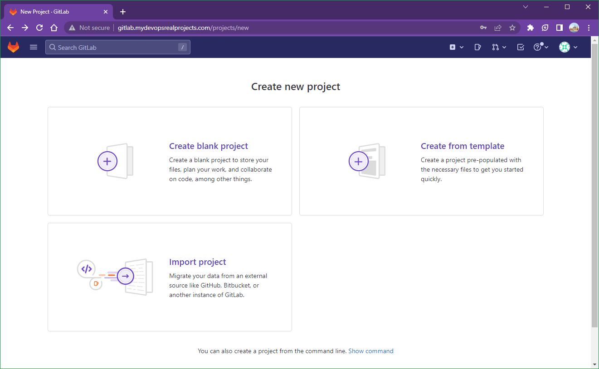
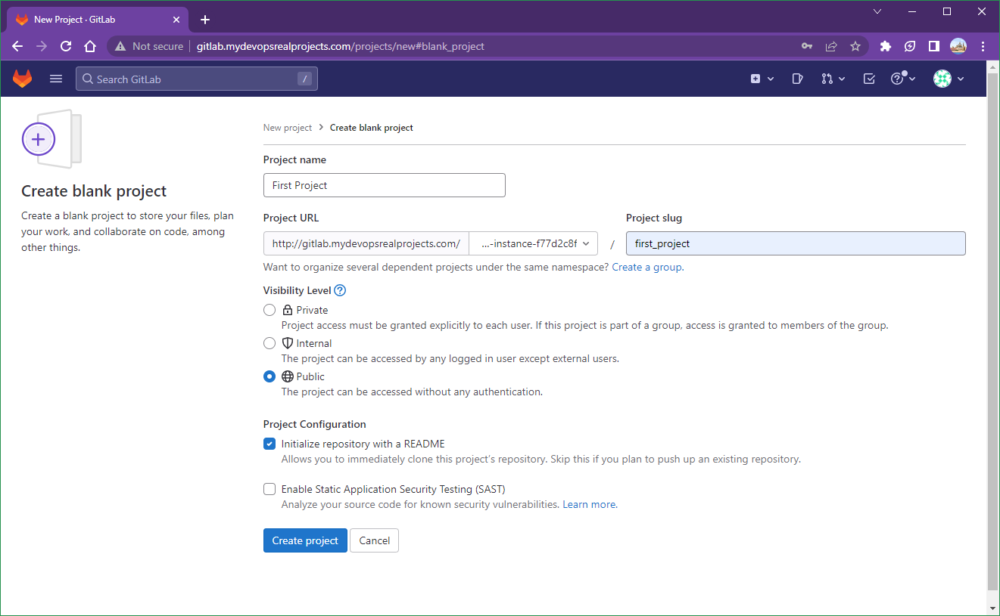
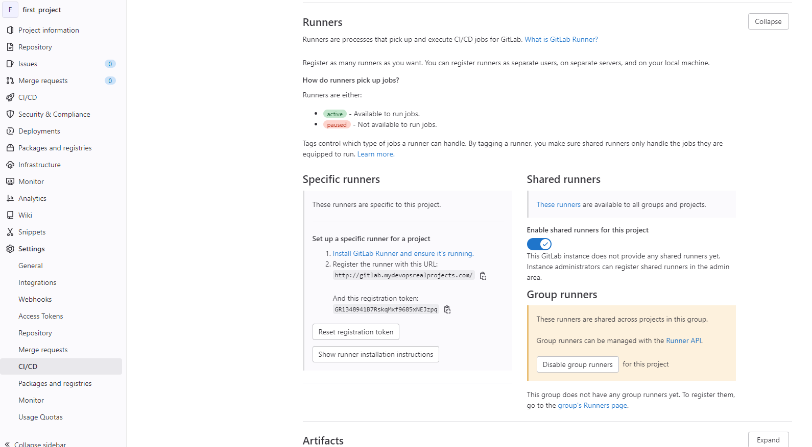
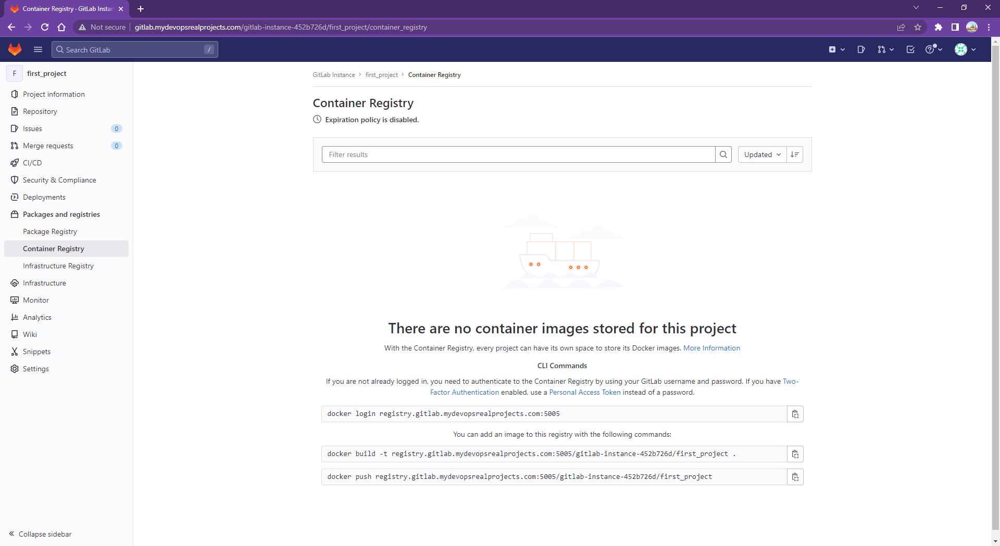
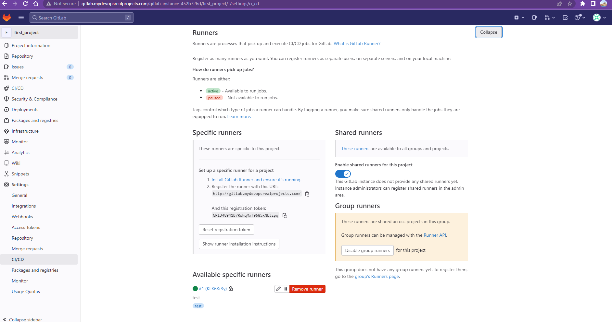
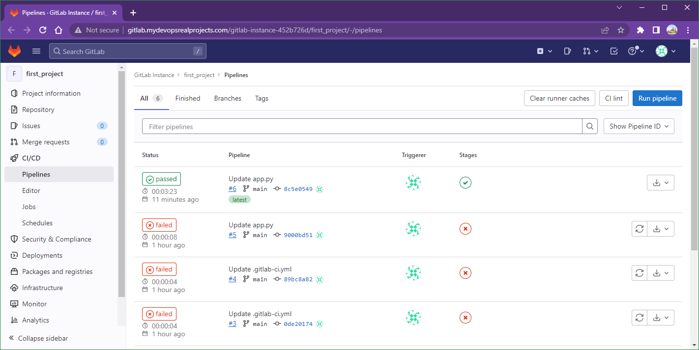
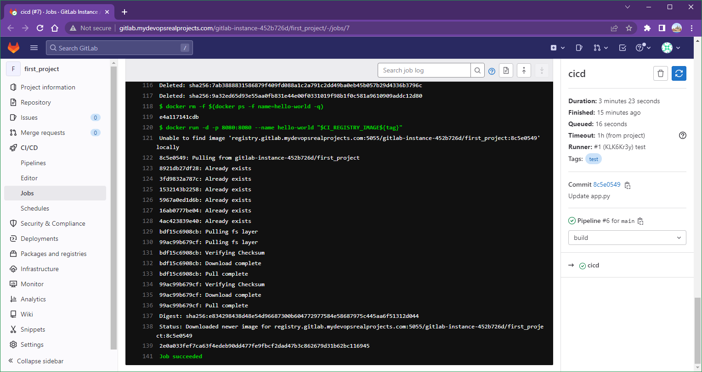
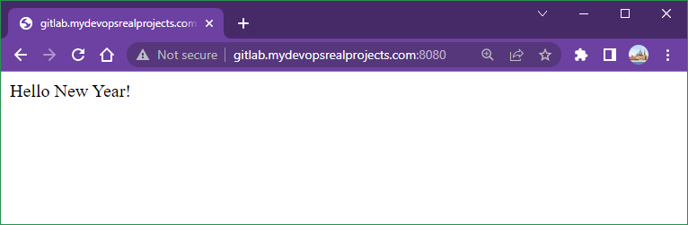
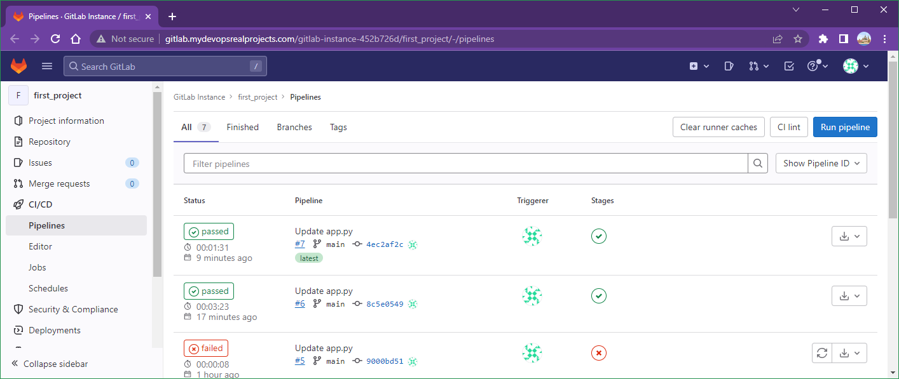
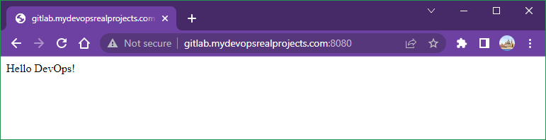

# Lab 003: GitLab CICD Pipeline

Windows + Ubuntu

Works

## Steps

## 1. Config the GitLab domain name

In this lab, we will use `mydevopsrealprojects.com` as the GitLab domain name.

Hence the gitlab URL is `http://gitlab.mydevopsrealprojects.com`

We need it in the `docker-compose.yml` file.

## 2. Configure the **hosts** file

<!--  
Windows: `C:\Windows\System32\drivers\etc\hosts`
-->

Add these 2 entries in Windows's hosts file `C:\Windows\System32\drivers\etc\hosts`

```dos
192.168.33.10 gitlab.mydevopsrealprojects.com
192.168.33.10 registry.gitlab.mydevopsrealprojects.com
```

<!--
Unix / Mac: `/etc/hosts`
-->

Add these 2 entries in Vagrant Ubuntu's hosts file `/etc/hosts`

```bash
127.0.0.1 gitlab.mydevopsrealprojects.com
127.0.0.1 registry.gitlab.mydevopsrealprojects.com
```

<!--
## 3. Config the root password

```yml
    hostname: 'gitlab.mydevopsrealprojects.com'
    environment:
      GITLAB_ROOT_PASSWORD: "Password2023#"
      EXTERNAL_URL: "http://gitlab.mydevopsrealprojects.com"
      GITLAB_OMNIBUS_CONFIG: 
        gitlab_rails['initial_root_password'] = "Password2023#"
```
-->

## 3. Docker compose

<!--
Docker login with the GitHub token

```dos
docker login ghcr.io -u briansu2004
```

Docker compose
-->

Start Vagrant

```dos
vagrant up
vagrant ssh
```

In Vagrant,

```dos
git clone https://github.com/briansu2004/udemy-devops-9projects-free.git
cd udemy-devops-9projects-free/003-GitlabCICD
docker compose up
```

## 4. Login to the GitLab

Wait for about **5 ~ 10 minutes** for the server to fully start up.

Then go to [http://gitlab.mydevopsrealprojects.com](http://gitlab.mydevopsrealprojects.com) and login the username `root` and the password `Password2023#`.

## 5. Get the GitLab registration token

Click **"New project"** to create our first project

-> Click **"Create blank project"**

-> Type our project name in **"Lab Name"**

-> Select **"Public"**

-> Click **"Create project"**

-> Go to the new project we just created, and **"Setting"** -> **"CI/CD"**

-> Expand **"Runners"** section.

-> **Make a note** of **"URL** and **registration token** in **"Specific runners"** section for below runner installation used.







We need to use the URL `http://gitlab.mydevopsrealprojects.com/` (not `https`) and the registration token to Register the runner.

## 6. Update the certificates

Since the initial Gitlab server **certificate** is missing some info and can't be used by the gitlab runner, we may have to **regenerate** a new one and **reconfigure** in the gitlab server.

```dos
docker exec -it $(docker ps -f name=web -q) bash

mkdir /etc/gitlab/ssl
cd /etc/gitlab/ssl

openssl genrsa -out ca.key 2048

openssl req -new -x509 -days 365 -key ca.key -subj "/C=CN/ST=GD/L=SZ/O=Acme, Inc./CN=Acme Root CA" -out ca.crt

export YOUR_GITLAB_DOMAIN=mydevopsrealprojects.com
echo $YOUR_GITLAB_DOMAIN

openssl req -newkey rsa:2048 -nodes -keyout gitlab.$YOUR_GITLAB_DOMAIN.key -subj "/C=CN/ST=GD/L=SZ/O=Acme, Inc./CN=*.$YOUR_GITLAB_DOMAIN" -out gitlab.$YOUR_GITLAB_DOMAIN.csr

openssl x509 -req -extfile <(printf "subjectAltName=DNS:$YOUR_GITLAB_DOMAIN,DNS:gitlab.$YOUR_GITLAB_DOMAIN") -days 365 -in gitlab.$YOUR_GITLAB_DOMAIN.csr -CA ca.crt -CAkey ca.key -CAcreateserial -out gitlab.$YOUR_GITLAB_DOMAIN.crt

ls -l
```

Certificate for nginx (container registry)

```dos
openssl req -newkey rsa:2048 -nodes -keyout registry.gitlab.$YOUR_GITLAB_DOMAIN.key -subj "/C=CN/ST=GD/L=SZ/O=Acme, Inc./CN=*.$YOUR_GITLAB_DOMAIN" -out registry.gitlab.$YOUR_GITLAB_DOMAIN.csr

openssl x509 -req -extfile <(printf "subjectAltName=DNS:$YOUR_GITLAB_DOMAIN,DNS:gitlab.$YOUR_GITLAB_DOMAIN,DNS:registry.gitlab.$YOUR_GITLAB_DOMAIN") -days 365 -in registry.gitlab.$YOUR_GITLAB_DOMAIN.csr -CA ca.crt -CAkey ca.key -CAcreateserial -out registry.gitlab.$YOUR_GITLAB_DOMAIN.crt

ls -l
cat gitlab.$YOUR_GITLAB_DOMAIN.crt
cat registry.gitlab.$YOUR_GITLAB_DOMAIN.crt

exit
```

## 7. Enable the container register

Add below lines in the bottom of the file `/etc/gitlab/gitlab.rb`.

```dos
docker exec -it $(docker ps -f name=web -q) bash

tail -25 /etc/gitlab/gitlab.rb

cat >> /etc/gitlab/gitlab.rb <<EOF

 registry_external_url 'https://registry.gitlab.$YOUR_GITLAB_DOMAIN:5055'  # Note: for Windows
 gitlab_rails['registry_enabled'] = true
 gitlab_rails['registry_host'] = "registry.gitlab.$YOUR_GITLAB_DOMAIN"
 gitlab_rails['registry_port'] = "5005"
 gitlab_rails['registry_path'] = "/var/opt/gitlab/gitlab-rails/shared/registry"
 gitlab_rails['registry_api_url'] = "http://127.0.0.1:5000"
 gitlab_rails['registry_key_path'] = "/var/opt/gitlab/gitlab-rails/certificate.key"
 registry['enable'] = true
 registry['registry_http_addr'] = "127.0.0.1:5000"
 registry['log_directory'] = "/var/log/gitlab/registry"
 registry['env_directory'] = "/opt/gitlab/etc/registry/env"
 registry['env'] = {
   'SSL_CERT_DIR' => "/opt/gitlab/embedded/ssl/certs/"
 }
 # Note: Make sure to update below 'rootcertbundle' default value 'certificate.crt" to 'gitlab-registry.crt', otherwise we may get error.
 registry['rootcertbundle'] = "/var/opt/gitlab/registry/gitlab-registry.crt"
 nginx['ssl_certificate'] = "/etc/gitlab/ssl/registry.gitlab.$YOUR_GITLAB_DOMAIN.crt"
 nginx['ssl_certificate_key'] = "/etc/gitlab/ssl/registry.gitlab.$YOUR_GITLAB_DOMAIN.key"
 registry_nginx['enable'] = true
 registry_nginx['listen_port'] = 5005
EOF

tail -25 /etc/gitlab/gitlab.rb
```

Reconfigure the gitlab to apply above change

```dos
gitlab-ctl reconfigure

gitlab-ctl restart

exit
```

## 8. Update the certificates for the docker client

In order to make **docker login** work, we need to add the **certificate** in the docker certs folder.

<!--
sudo mkdir -p /etc/docker/certs.d/registry.gitlab.$YOUR_GITLAB_DOMAIN:5005
sudo docker cp $(docker ps -f name=web -q):/etc/gitlab/ssl/registry.gitlab.$YOUR_GITLAB_DOMAIN.crt /etc/docker/certs.d/registry.gitlab.$YOUR_GITLAB_DOMAIN:5005/
sudo ls /etc/docker/certs.d/registry.gitlab.$YOUR_GITLAB_DOMAIN:5005
cat /etc/docker/certs.d/registry.gitlab.$YOUR_GITLAB_DOMAIN:5005/registry.gitlab.mydevopsrealprojects.com.crt
-->

```dos
# Login the host we are going to run the docker commands
# In the Vagrant Ubuntu
export YOUR_GITLAB_DOMAIN=mydevopsrealprojects.com
echo $YOUR_GITLAB_DOMAIN

sudo mkdir -p /etc/docker/certs.d/registry.gitlab.$YOUR_GITLAB_DOMAIN:5055
sudo docker cp $(docker ps -f name=web -q):/etc/gitlab/ssl/registry.gitlab.$YOUR_GITLAB_DOMAIN.crt /etc/docker/certs.d/registry.gitlab.$YOUR_GITLAB_DOMAIN:5055/
sudo ls /etc/docker/certs.d/registry.gitlab.$YOUR_GITLAB_DOMAIN:5055
cat /etc/docker/certs.d/registry.gitlab.$YOUR_GITLAB_DOMAIN:5055/registry.gitlab.mydevopsrealprojects.com.crt

# Test docker login and we should be able to login now
# Note: for Windows we can't use the default 5005 as it is blocked
docker login registry.gitlab.$YOUR_GITLAB_DOMAIN:5055 
Username: root
Password: Password2023#

WARNING! Your password will be stored unencrypted in /home/devops/.docker/config.json.
Configure a credential helper to remove this warning. See
https://docs.docker.com/engine/reference/commandline/login/#credentials-store

Login Succeeded

# You can also test if the docker image push works once login successfully
```

<!--
export YOUR_GITLAB_DOMAIN=mydevopsrealprojects.com
echo $YOUR_GITLAB_DOMAIN
sudo mkdir -p /etc/docker/certs.d/registry.gitlab.$YOUR_GITLAB_DOMAIN:5055
sudo docker cp $(docker ps -f name=web -q):/etc/gitlab/ssl/registry.gitlab.$YOUR_GITLAB_DOMAIN.crt /etc/docker/certs.d/registry.gitlab.$YOUR_GITLAB_DOMAIN:5055/
sudo ls /etc/docker/certs.d/registry.gitlab.$YOUR_GITLAB_DOMAIN:5055
-->

Test if the docker image push works once login successfully -

Login to the gitlab server web UI and go to the project created, and then go to "Packages and registries" -> "Container Registry", should be able to see the valid registry URL we suppose to use in order to build and push our image.

e.g. `docker build -t registry.gitlab.mydevopsrealprojects.com:5005/gitlab-instance-d350f73c/first-projct .`



## 9. Configure the **gitlab-runner**

Login to gitlab-runner and run commands below.

Please note the tag below has to match with the `tags` section in `.gitlab-ci.yml` file:

```yml
  tags:
    - test
```

```dos
export YOUR_GITLAB_DOMAIN=mydevopsrealprojects.com
echo $YOUR_GITLAB_DOMAIN
docker exec $(docker ps -f name=web -q) cat /etc/gitlab/ssl/gitlab.$YOUR_GITLAB_DOMAIN.crt
docker exec $(docker ps -f name=web -q) cat /etc/gitlab/ssl/registry.gitlab.$YOUR_GITLAB_DOMAIN.crt
```

```dos
docker exec -it $(docker ps -f name=gitlab-runner -q) bash
cd /usr/local/share/ca-certificates/
ls -l

cat > /usr/local/share/ca-certificates/gitlab-server.crt <<EOF
# <Paste above gitlab server certificate here>
EOF
```

<!--
cat > /usr/local/share/ca-certificates/gitlab-server.crt <<EOF
-----BEGIN CERTIFICATE-----
MIIDijCCAnKgAwIBAgIUQRt4YrO0Pvw8oXPhHFQ7JlleJ7swDQYJKoZIhvcNAQEL
BQAwUzELMAkGA1UEBhMCQ04xCzAJBgNVBAgMAkdEMQswCQYDVQQHDAJTWjETMBEG
A1UECgwKQWNtZSwgSW5jLjEVMBMGA1UEAwwMQWNtZSBSb290IENBMB4XDTIzMDEy
MTIxMTAxNFoXDTI0MDEyMTIxMTAxNFowYTELMAkGA1UEBhMCQ04xCzAJBgNVBAgM
AkdEMQswCQYDVQQHDAJTWjETMBEGA1UECgwKQWNtZSwgSW5jLjEjMCEGA1UEAwwa
Ki5teWRldm9wc3JlYWxwcm9qZWN0cy5jb20wggEiMA0GCSqGSIb3DQEBAQUAA4IB
DwAwggEKAoIBAQDT9CNE8dwsDMF3QYSpsfTOeUwh/4U4b92VCzniwlpITxf7Tvwu
7D39to7yDbwNl8JNBR7dCqdgeRljLiswW7G1UhQJ+hh7hYTrypTfrkWM/J759kpo
y6PjuaEU9MVPfk00LR9WLuZJ8PPFK+cU+UT1IRf2xpknr+/25OrBUKJRF1EbwQgE
sIsXbTuDWlcQHnIztim5L7ie2NpzIH/weT6V7KngvhAL16HUlpUvrCfSVd7fDoZN
K7L9DJ0N+TxZ0P6ejX6NZxVeoLqNVGlbdaJjUrBhT3EGBjvXe3jevPKSoTNnO6+2
WFu6wkSzD33G0ZYtqHUtSkszxfAQ2zWkOJjVAgMBAAGjSDBGMEQGA1UdEQQ9MDuC
GG15ZGV2b3BzcmVhbHByb2plY3RzLmNvbYIfZ2l0bGFiLm15ZGV2b3BzcmVhbHBy
b2plY3RzLmNvbTANBgkqhkiG9w0BAQsFAAOCAQEAX0DV9YZqpA69N5++ANJdcSw5
lixO7j27wnwBMiX1s+eKZogXMNuCqkCe6jJkFh/QurxEfM+914ayzJBfv+F/Znjx
i8ehHdtuhlyVWRi5KwbLP9T28TnRcVo4lG1TyvdgyM4plEaRzT0U7IlKbCkbb78U
0IrsfzP33n6W5zxLv7ZpGq/YQ8A3vTxOGuxw4i9OAZedW1QA6wlcOeFaNBaST0jy
tP4uqUBrj9wTxRz/KHxxx30gFs87ZV/MK4sWGPYjzU0ENGUzeHtkfeVsmybDcq5r
s91rZfheAtlTJpraTOq2KBxx1IqSF45dNOONmmjVEMo5aECBIr3ZEO4msu3cLQ==
-----END CERTIFICATE-----
EOF
-->

```dos
cat > /usr/local/share/ca-certificates/registry.gitlab-server.crt <<EOF
# <Paste above gitlab registry certificate here>
EOF
```

<!--
cat > /usr/local/share/ca-certificates/registry.gitlab-server.crt <<EOF
-----BEGIN CERTIFICATE-----
MIIDtDCCApygAwIBAgIUQRt4YrO0Pvw8oXPhHFQ7JlleJ7wwDQYJKoZIhvcNAQEL
BQAwUzELMAkGA1UEBhMCQ04xCzAJBgNVBAgMAkdEMQswCQYDVQQHDAJTWjETMBEG
A1UECgwKQWNtZSwgSW5jLjEVMBMGA1UEAwwMQWNtZSBSb290IENBMB4XDTIzMDEy
MTIxMTA0MloXDTI0MDEyMTIxMTA0MlowYTELMAkGA1UEBhMCQ04xCzAJBgNVBAgM
AkdEMQswCQYDVQQHDAJTWjETMBEGA1UECgwKQWNtZSwgSW5jLjEjMCEGA1UEAwwa
Ki5teWRldm9wc3JlYWxwcm9qZWN0cy5jb20wggEiMA0GCSqGSIb3DQEBAQUAA4IB
DwAwggEKAoIBAQCni7H94DdILJ1Sh7Bhb03JhSAu6em0uVBcQkK2iS0AX43e/xJ7
McNws5qbiCEjmQODalBXYkFquWRj6kwiEuHYUYqPZlce+wfLlg/f7Zrf/EE73gS2
1D3uhUEMISa34NTnUHXo87NlZ5Ybp6a/GgTwdTuVzwuD9svuGNePInKULYzeAQ6k
quOyP3gRu1Gg3qWLeQ64YuBz+ftktXmvIB9e+iKkl4Vv/2gAI9gXfxVZ50GzLmnB
r3WYRiOimg3WseVo5eNvIRsdKQLcMj9F8AvKCC37GpnzKIvTjq/nFfLnEri0T1AD
06nHEMT3TbnCLOmILZM8hkE27kuBR9x5BY2rAgMBAAGjcjBwMG4GA1UdEQRnMGWC
GG15ZGV2b3BzcmVhbHByb2plY3RzLmNvbYIfZ2l0bGFiLm15ZGV2b3BzcmVhbHBy
b2plY3RzLmNvbYIocmVnaXN0cnkuZ2l0bGFiLm15ZGV2b3BzcmVhbHByb2plY3Rz
LmNvbTANBgkqhkiG9w0BAQsFAAOCAQEAPJGP5/eAzF3wrjz8PHFDgbw9xX9iq2SF
T3r9te3gohmulGTC6HI1hBaZomGo0GffM4sl1PX+pzpMlI6m5E5iaA6/+PeuFsr/
s0/x9AemPkqGlm2cQMwrdDPss1LHuhIz+rlfuuzKWQpl3bnVK/oISpINOb1VYxYF
7eJxh86CueUqnqLTSFltUdARteW8XRu/1F2aPvqKsVdArGmOre3SLIKVcBxx3Nmw
oexqTnI9PMOmK7V0s8PYUlXTXW8UQX2X8/wMWChziwN1XlZzuhnFJZ/0e9K/LelA
ZGCHDw8t3O8UJhfMKKVBdudgspEYGrzWt7UbrekR32QLTvPpx36aQQ==        
-----END CERTIFICATE-----
EOF
-->

```dos
ls -l

update-ca-certificates

gitlab-runner register 
```

```dos
Enter the GitLab instance URL (for example, https://gitlab.com/):
http://gitlab.mydevopsrealprojects.com

Enter the registration token:
<Paste the token retrieved in Step 6>
GR1348941XikWdWB9K5DBxBG_VH9_

Enter a description for the runner:
[bad518d25b44]: test

# HERE tag below has to match with tags in .gitlab-ci.yml
Enter tags for the runner (comma-separated):
test

Enter optional maintenance note for the runner:
test

Registering runner... succeeded                     runner=GR1348941Pjv5Qzaz
Enter an executor: ssh, docker+machine, docker-ssh, docker, parallels, shell, virtualbox, docker-ssh+machine, kubernetes, custom:
shell
```

<!--
If error -

```bash
WARNING: Support for registration tokens and runner parameters in the 'register' command has been deprecated in GitLab Runner 15.6 and will be replaced with support for authentication tokens. For more information, see https://gitlab.com/gitlab-org/gitlab/-/issues/380872 
ERROR: Registering runner... failed                 runner=GR1348941B7RskqMx status=couldn't execute POST against https://gitlab.mydevopsrealprojects.com/api/v4/runners: Post "https://gitlab.mydevopsrealprojects.com/api/v4/runners": dial tcp 172.20.0.4:443: connect: connection refused
PANIC: Failed to register the runner.
```

install net-tools and iputils-ping

```bash
apt update && apt upgrade
apt install net-tools iputils-ping
```

If still won't work, destroy vagrant image and start over.
-->

Success messages:

```dos
Runner registered successfully. Feel free to start it, but if it's running already the config should be automatically reloaded!

Configuration (with the authentication token) was saved in "/etc/gitlab-runner/config.toml" 
root@bad518d25b44:/usr/local/share/ca-certificates# cat /etc/gitlab-runner/config.toml 
```

Once we finish above step, we should be able to see an available running in the project's CICD Runners section.



## 10. Prepare the GitLab project repo

**git clone** from our gitlab project repo to our local and copy necessary files from the repo (in the same folder as this README.md)

```bash
ls -la ~/udemy-devops-9projects-free/003-GitlabCICD/
cd
git clone http://gitlab.mydevopsrealprojects.com/gitlab-instance-452b726d/first_project.git

Username for 'http://gitlab.mydevopsrealprojects.com': root
Password for 'http://root@gitlab.mydevopsrealprojects.com': Password2023#

cd ~/first_project
cp ~/udemy-devops-9projects-free/003-GitlabCICD/{app.py,Dockerfile,requirements.txt,.gitlab-ci.yml} .
ls -la
git add .
git commit -m "First commit"
git push
```

Once we push the code, we should be able to see the pipeline is automatically triggered under the project -> "CI/CD" -> "Jobs"





## 11. Enjoy the GitLab pipeline

- Check the hello-world app

[http://gitlab.mydevopsrealprojects.com:8080](http://gitlab.mydevopsrealprojects.com:8080)



- Update the code

Try to update the `app.py` file, e.g. update from `return "Hello New Year!"` to `return "Hello DevOps!"`.

Save the change and then

```dos
git add .
git commit -am "Update code"
git push
```

- Monitor the CICD pipeline

- Once the pipeline is completed, re-visit the hello-world app to verift if the content is changed.




