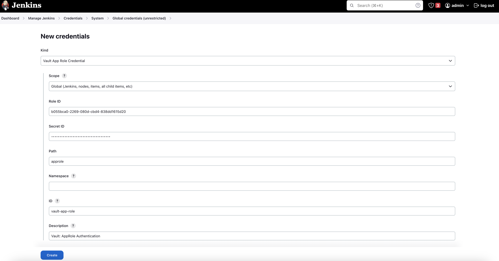
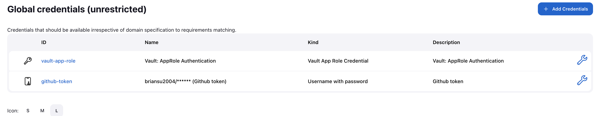
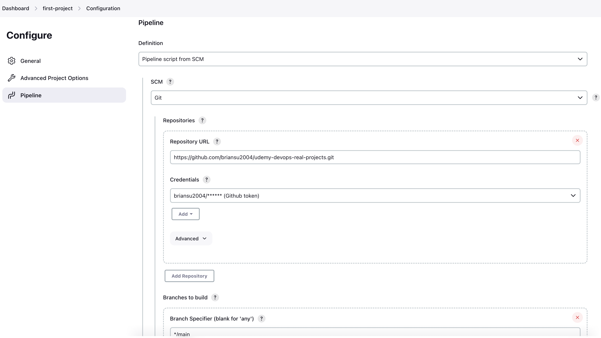
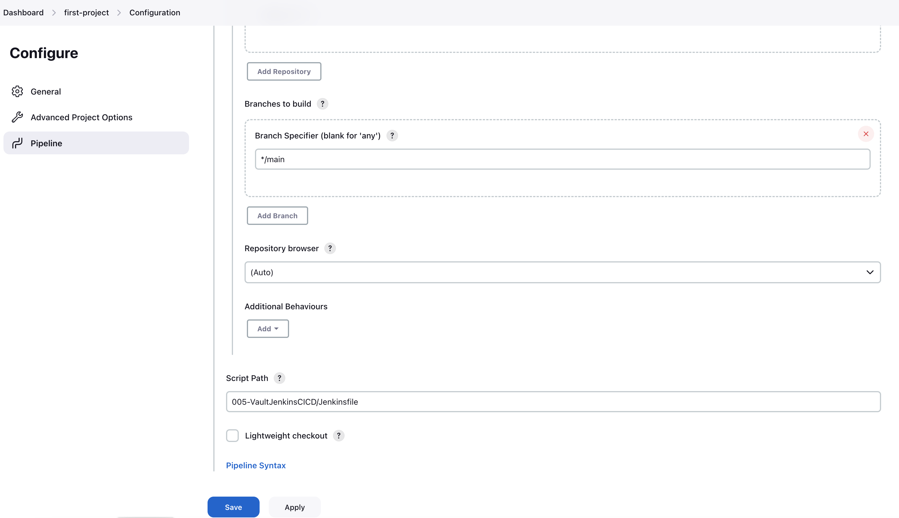

# Lab 005: Vault Jenkins Pipeline

## Lab goal

In this lab, we will learn how to integrate Vault into Jenkins pipeline, as well as the basic usage of Hashicorp Vault.

## Prerequisites

### Install Docker in Windows

## Steps

### 1. Docker compose

```dos
rd /s /q udemy-devops-real-projects
git clone https://github.com/briansu2004/udemy-devops-real-projects.git
cd udemy-devops-real-projects/005-VaultJenkinsCICD
docker-compose up
```

### 2. Fix the docker-compose issues if possible

We use the file `plugins.txt` to manage install plug-ins. However, it always forces us to use the latest versions.

Hence the 1st step `docker-compose up` will fail if there is a new version available.

e.g.

```dos
 => => naming to docker.io/library/005-vaultjenkinscicd-vault                                                                                                                               0.0s 
 => [005-vaultjenkinscicd-jenkins 2/4] COPY plugins.txt /usr/share/jenkins/ref/plugins.txt                                                                                                  0.3s 
 => ERROR [005-vaultjenkinscicd-jenkins 3/4] RUN jenkins-plugin-cli --plugin-file /usr/share/jenkins/ref/plugins.txt                                                                        5.1s 
------
 > [005-vaultjenkinscicd-jenkins 3/4] RUN jenkins-plugin-cli --plugin-file /usr/share/jenkins/ref/plugins.txt:
#0 5.036 Multiple plugin prerequisites not met:
#0 5.036 Plugin docker-workflow:528.v7c193a_0b_e67c (via pipeline-model-definition:2.2118.v31fd5b_9944b_5->git-client:4.0.0) depends on configuration-as-code:1569.vb_72405b_80249, but there is an older version defined on the t
an older version defined on the top level - configuration-as-code:1559.v38a_b_2e3b_6b_b_7,
#0 5.036 Plugin git:4.12.1 (via git-client:4.0.0) depends on configuration-as-code:1569.vb_72405b_80249, but there is an older version defined on the top level - configuration-as-code:1559.v38a_b_2e3b_6b_b_7_b_2e3b_6b_b_7
------
failed to solve: executor failed running [/bin/sh -c jenkins-plugin-cli --plugin-file /usr/share/jenkins/ref/plugins.txt]: exit code: 1
```

The solution is to update the plugin file `plugins.txt` manually based on the error messages and then re-run `docker-compose up`.

e.g.


### 3. Initiate Vault

a. **Initializing** the Vault

`docker ps -f name=vault-1 -q`

Take note the container ID and use in the next script.

`docker exec -it <container_vault_id> sh`

Then

```dos
export VAULT_ADDR='http://127.0.0.1:8200'
vault operator init
```

<!--
```dos
docker ps -f name=005-vaultjenkinscicd-vault-1 -q
# e.g. ed63f35f2c0e is the container ID
docker exec -it ed63f35f2c0e sh # ed63f35f2c0e is the container ID
export VAULT_ADDR='http://127.0.0.1:8200'
vault operator init
```
-->

**Note:**

Make a note of the output. This is the only time ever we see those unseal keys and root token. If we lose it, we won't be able to seal vault any more.

<!--
```dos
/vault/data # export VAULT_ADDR='http://127.0.0.1:8200'
/vault/data # vault operator init
Unseal Key 1: daPMcDgtExmcjF86fj7UGQkgtDsKjnMDMdf1iaKfCMt6
Unseal Key 2: 1epZVWjzG26aLpi2fzp2Yz08Ly4KIcMfXTnlihxoWArZ
Unseal Key 3: Oq+PLT1+Aids617FvIsjBZfN+2jfh8YPtJrZoU97mYgl
Unseal Key 4: SBJPdvCWiUtAPewUQD6dS16p4kZEC+XB2iwmMH6ocA4j
Unseal Key 5: Kgto82MwUVEIclHMof67OhUn/VRyj/zMvXkn+6myk9sU

Initial Root Token: hvs.JxLWD9Hs2b41sA01sr44JQUq

Vault initialized with 5 key shares and a key threshold of 3. Please securely
distribute the key shares printed above. When the Vault is re-sealed,
restarted, or stopped, we must supply at least 3 of these keys to unseal it
before it can start servicing requests.

Vault does not store the generated root key. Without at least 3 keys to
reconstruct the root key, Vault will remain permanently sealed!

It is possible to generate new unseal keys, provided we have a quorum of
existing unseal keys shares. See "vault operator rekey" for more information.
```
-->

b. **Unsealing** the vault

```dos
vault operator unseal <unseal key 1>
vault operator unseal <unseal key 2>
vault operator unseal <unseal key 3>
```

Used the unseal keys are from previous output. We need at lease **3 keys** to unseal the vault.

<!--
```dos
/vault/data # vault operator unseal daPMcDgtExmcjF86fj7UGQkgtDsKjnMDMdf1iaKfCMt6
Key                Value
---                -----
Seal Type          shamir
Initialized        true
Sealed             true
Total Shares       5
Threshold          3
Unseal Progress    1/3
Unseal Nonce       3ab88bdd-967b-2433-fc0b-342060f8543a
Version            1.12.1
Build Date         2022-10-27T12:32:05Z
Storage Type       raft
HA Enabled         true
/vault/data # vault operator unseal 1epZVWjzG26aLpi2fzp2Yz08Ly4KIcMfXTnlihxoWArZ
Key                Value
---                -----
Seal Type          shamir
Initialized        true
Sealed             true
Total Shares       5
Threshold          3
Unseal Progress    2/3
Unseal Nonce       3ab88bdd-967b-2433-fc0b-342060f8543a
Version            1.12.1
Build Date         2022-10-27T12:32:05Z
Storage Type       raft
HA Enabled         true
/vault/data # vault operator unseal Oq+PLT1+Aids617FvIsjBZfN+2jfh8YPtJrZoU97mYgl
Key                     Value
---                     -----
Seal Type               shamir
Initialized             true
Sealed                  false
Total Shares            5
Threshold               3
Version                 1.12.1
Build Date              2022-10-27T12:32:05Z
Storage Type            raft
Cluster Name            vault-cluster-e490a263
Cluster ID              a9746759-1955-e2c8-4e10-88a2e99c2fe1
HA Enabled              true
HA Cluster              n/a
HA Mode                 standby
Active Node Address     <none>
Raft Committed Index    31
Raft Applied Index      31
```
-->

When the value of `Sealed` changes to **false**, the Vault is unsealed. We should see below similar output once it is unsealed.

<!--
```dos
Unseal Key (will be hidden): 
Key                     Value
---                     -----
Seal Type               shamir
Initialized             true
Sealed                  false
Total Shares            5
Threshold               3
Version                 1.12.1
Build Date              2022-10-27T12:32:05Z
Storage Type            raft
Cluster Name            vault-cluster-403fc7a0
Cluster ID              772cef22-77d2-11bb-f16b-7ef69d85ac0e
HA Enabled              true
HA Cluster              n/a
HA Mode                 standby
Active Node Address     <none>
Raft Committed Index    31
Raft Applied Index      31
```
-->

c. Sign in to vault with **root** user

Type `vault login` and enter the `Initial Root Token` retrieving from step a.

```dos
/vault/data # vault login
Token (will be hidden): 
Success! we are now authenticated. The token information displayed below
is already stored in the token helper. we do NOT need to run "vault login"
again. Future Vault requests will automatically use this token.

Key                  Value
---                  -----
token                hvs.JxLWD9Hs2b41sA01sr44JQUq
token_accessor       865teFpJSm3Zq2GId00iqK0U
token_duration       ∞
token_renewable      false
token_policies       ["root"]
identity_policies    []
policies             ["root"]
```

### 4. Enable Vault KV Secrets Engine Version 2

<!--
Refer to <https://developer.hashicorp.com/vault/docs/secrets/kv/kv-v2>
-->

```dos
vault secrets enable -version=2 kv-v2

vault kv put -mount=kv-v2 devops-secret username=root password=changeme
```

<!--
```dos
/vault/data # vault secrets enable -version=2 kv-v2
Success! Enabled the kv-v2 secrets engine at: kv-v2/
/vault/data # vault kv put -mount=kv-v2 devops-secret username=root password=changeme
====== Secret Path ======
kv-v2/data/devops-secret

======= Metadata =======
Key                Value
---                -----
created_time       2023-04-01T17:42:12.087140006Z
custom_metadata    <nil>
deletion_time      n/a
destroyed          false
version            1
```
-->

we can **read** the data by running this:

```dos
vault kv get -mount=kv-v2 devops-secret
```

<!--
```dos
/vault/data # vault kv get -mount=kv-v2 devops-secret
====== Secret Path ======
kv-v2/data/devops-secret

======= Metadata =======
Key                Value
---                -----
created_time       2023-04-01T17:42:12.087140006Z
custom_metadata    <nil>
deletion_time      n/a
destroyed          false
version            1

====== Data ======
Key         Value
---         -----
password    changeme
username    root
```
-->

Then we should be able to see below output

```dos
====== Data ======
Key         Value
---         -----
password    changeme
username    root

```

<!--
Note:

Since version 2 kv has prefixed `data/`, our secret path will be `kv-v2/data/devops-secret`, instead of `kv-v2/devops-secret`
-->

### 5. Write a Vault Policy and create a token

a. **Write** a policy

```dos
cat > policy.hcl  <<EOF
path "kv-v2/data/devops-secret/*" {
  capabilities = ["create", "update","read"]
}
EOF
vault policy write first-policy policy.hcl
vault policy list
vault policy read first-policy
```

<!--
```dos
/vault/data # cat > policy.hcl  <<EOF
> path "kv-v2/data/devops-secret/*" {
>   capabilities = ["create", "update","read"]
> }
> EOF
/vault/data # vault policy write first-policy policy.hcl
Success! Uploaded policy: first-policy
/vault/data # vault policy list
default
first-policy
root
/vault/data # vault policy read first-policy
path "kv-v2/data/devops-secret/*" {
  capabilities = ["create", "update","read"]
}
/vault/data # 
```
-->

b. **Enable approle**

```dos
vault auth enable approle
```

<!--
```dos
/vault/data # vault auth enable approle
Success! Enabled approle auth method at: approle/
```
-->

c. Create an **role**

```dos
vault write auth/approle/role/first-role \
    secret_id_ttl=10000m \
    token_num_uses=10 \
    token_ttl=20000m \
    token_max_ttl=30000m \
    secret_id_num_uses=40 \
    token_policies=first-policy

# Check the role id
export ROLE_ID="$(vault read -field=role_id auth/approle/role/first-role/role-id)"
echo $ROLE_ID
```

<!--
```dos
/vault/data # vault write auth/approle/role/first-role \
>     secret_id_ttl=10000m \
>     token_num_uses=10 \
>     token_ttl=20000m \
>     token_max_ttl=30000m \
>     secret_id_num_uses=40 \
>     token_policies=first-policy
Success! Data written to: auth/approle/role/first-role
/vault/data # export ROLE_ID="$(vault read -field=role_id auth/approle/role/first-role/role-id)"
/vault/data # echo $ROLE_ID
b055bca0-2269-080d-cbd4-838dd1615d20
/vault/data # 
```
-->

**Note:**

Please make a note as it will be needed when configuring Jenkins credential

d. Create a **secret id** via the previous role

```dos
export SECRET_ID="$(vault write -f -field=secret_id auth/approle/role/first-role/secret-id)"
echo $SECRET_ID
```

<!--
```dos
/vault/data # export SECRET_ID="$(vault write -f -field=secret_id auth/approle/role/first-role/secret-id)"
/vault/data # echo $SECRET_ID
18ca00b9-3e7b-3f62-9e82-bba2e78221ea
```
-->

**Note:**

Please make a note as it will be needed when configuring Jenkins credential

e. Create a **token** with the role ID and secret ID

```dos
apk add jq
export VAULT_TOKEN=$(vault write auth/approle/login role_id="$ROLE_ID" secret_id="$SECRET_ID" -format=json|jq .auth.client_token)
echo $VAULT_TOKEN
VAULT_TOKEN=$(echo $VAULT_TOKEN|tr -d '"')
vault token lookup | grep policies
```

<!--
```dos
/vault/data # apk add jq
fetch <https://dl-cdn.alpinelinux.org/alpine/v3.14/main/x86_64/APKINDEX.tar.gz>
fetch <https://dl-cdn.alpinelinux.org/alpine/v3.14/community/x86_64/APKINDEX.tar.gz>
(1/2) Installing oniguruma (6.9.7.1-r0)
(2/2) Installing jq (1.6-r1)
Executing busybox-1.33.1-r8.trigger
OK: 11 MiB in 21 packages
/vault/data # export VAULT_TOKEN=$(vault write auth/approle/login role_id="$ROLE_ID" secret_id="$SECRET_ID" -format=jso
n|jq .auth.client_token)
/vault/data # echo $VAULT_TOKEN
"hvs.CAESIDT0qAlPNxVjFA1Y3-1tl7_yx8jpSfyXWQget3v0EM3VGh4KHGh2cy5nMUVKYzBKTnZKeVlHOHExNFNBRzF1aWE"
/vault/data # VAULT_TOKEN=$(echo $VAULT_TOKEN|tr -d '"')
/vault/data # vault token lookup | grep policies
policies            [default first-policy]
```
-->

f. Write a **secret** via the new token

```dos
vault kv put -mount=kv-v2 devops-secret/team-1 username2=root2 password2=changemeagain
vault kv get -mount=kv-v2 devops-secret/team-1
```

<!--
```dos
/vault/data # vault kv put -mount=kv-v2 devops-secret/team-1 username2=root2 password2=changemeagain
========= Secret Path =========
kv-v2/data/devops-secret/team-1

======= Metadata =======
Key                Value
---                -----
created_time       2023-04-01T17:51:04.99758218Z
custom_metadata    <nil>
deletion_time      n/a
destroyed          false
version            1
/vault/data # vault kv get -mount=kv-v2 devops-secret/team-1
========= Secret Path =========
kv-v2/data/devops-secret/team-1

======= Metadata =======
Key                Value
---                -----
created_time       2023-04-01T17:51:04.99758218Z
custom_metadata    <nil>
deletion_time      n/a
destroyed          false
version            1

====== Data ======
Key          Value
---          -----
password2    changemeagain
username2    root2
```
-->

### 6. Add the role id and secret id to Jenkins

<!--
Refer to <https://plugins.jenkins.io/hashicorp-vault-plugin/#plugin-content-vault-app-role-credential>
-->

Login to the Jenkins website `http://127.0.0.1:8080/` with the username/password defined in our `.env` file.

Go to **"Manage Jenkins"** -> **"Manage Credentials"** ->  **"System"** -> **"Global credentials (unrestricted)"** -> Click **"Add Credentials"** and fill out the page in below selection:

- **Kind:** Vault App Role Credential
- **Scope:** Global (Jenkins,nodes,items,all child items,etc)
- **Role ID:** <ROLE_ID from previous step>
- **Secret ID:** <SECRET_ID from previous step>
- **Path:** approle
- **Namespace:** (Leave it blank)
- **ID:** (the credential id we will refer within Jenkins Pipeline. e.g. vault-app-role)
- **Description:** Vault: AppRole Authentication

<!--
```dos
/vault/data # echo $ROLE_ID
b055bca0-2269-080d-cbd4-838dd1615d20
/vault/data # echo $SECRET_ID
18ca00b9-3e7b-3f62-9e82-bba2e78221ea
```
-->



### 7. Create a github personal access token

Classic

### 8. Add github credential in Jenkins

Login to the Jenkins website and go to **"Manage Jenkins"** -> **"Manage Credentials"** ->  **"System"** -> **"Global credentials (unrestricted)"** -> Click **"Add Credentials"** and fill out the page below below selection:

- **Scope:** Global (Jenkins,nodes,items,all child items,etc)
- **Username:** (the github username)
- **Password:** `<the github personal access token>`
- **ID:** (the id which will be referred in Jenkinsfile, e.g. github-token)
- **Description:** Github token

<!--
briansu2004
github-token
-->

<!--
github
profile photo
settings
Developer settings
Personal access tokens
Tokens (classic)
Generate new token
Generate new token (classic)
https://github.com/settings/tokens/new
Note
Expiration
Scopes
Generate token
Copy
-->




### 9. Create a Jenkins Pipeline

a. In the Jenkins portal, click **"New Item"** in the left navigation lane, and type the item name (i.g. first-project) and select **"Pipeline"**. Click **"OK"** to configure the pipeline.

b. Go to **"Pipeline"** section and select **"Pipeline script from SCM"** in the **"Definition"** field

c. Select **"Git"** in **"SCM"** field

d. Add `https://github.com/briansu2004/udemy-devops-real-projects.git` in **"Repository URL"** field

e. Select our github credential in **"Credentials"**

f. Type `*/main` in **"Branch Specifier"** field

g. Type `005-VaultJenkinsCICD/Jenkinsfile` in **"Script Path"**

h. Unselect **"Lightweight checkout"**

<!--
<https://github.com/briansu2004/udemy-devops-real-projects/tree/main/005-VaultJenkinsCICD>
-->





### 10. Run the Jenins pipeline

Build now

Green / success!


