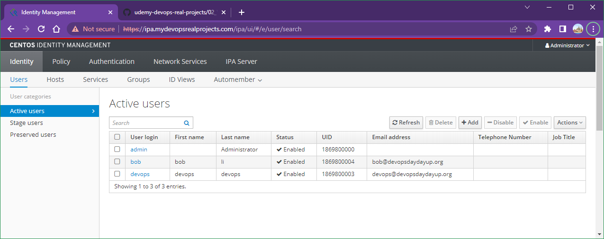

# Lab 007: Managing SSH Access with Vault

Windows + Ubunbu (Docker)

## Lab goal

In this lab, we will learn how to get a **signed SSH certificate** from **Vault** for a **LDAP** user in order to login a Vagrant VM via SSH.

We have a running **FreeIPA** system which has two users: `devops` and `bob`.

`devops` is a system admin and should have all administrator priviliages (i.g. `sudo` group), while `bob` is just a regular user.

In our **Vagrant** VM, there are two accounts.

One is `admin`, which is `sudo` user, and another one is `app-user`, which is regular user.

The goal is that the `devops` user in FreeIPA should be able to login the Vagrant VM in `admin` account, and `bob` user in FreeIPA should login as `app-user` in Vagrant VM. The SSH certificates should only last for 3 mins.

## Prerequisites

### 1. Install Vagrant for Windows

### 2. Install Docker for Ubunbu

### 3. Config the hosts for Windows and Ubuntu

a. In the local host (Windows), update `C:\Windows\System32\drivers\etc\hosts` by adding this entry: `192.168.33.10 ipa.mydevopsrealprojects.com`

Verify -

```dos
ping ipa.mydevopsrealprojects.com
```

b. In the Vagrant VM, update `/etc/hosts` by adding this entry: `0.0.0.0 ipa.mydevopsrealprojects.com`

```bash
vagrant ssh

sudo vim /etc/hosts

ping ipa.mydevopsrealprojects.com
```

### 4. Config the Ubuntu

Run below commands to stop systemd-resolved

```bash
sudo systemctl disable systemd-resolved
sudo systemctl stop systemd-resolved

sudo apt install jq -y
```

And add these entries to `/etc/resolv.conf`

```bash
nameserver 8.8.8.8
nameserver 8.8.4.4
```

## Steps

### 1. Docker compose

```bash
git clone https://github.com/briansu2004/udemy-devops-real-projects.git
cd udemy-devops-real-projects/007-VaultFreeIPAVagrantIAM
docker compose up
```

### 2. Initiate Vault

a. **Initializing** the Vault

```bash
docker exec -it $(docker ps -f name=vault-1 -q) sh

export VAULT_ADDR='http://192.168.33.10:8200'
vault operator init
```

Make a note of the output. This is the only time ever we see those **unseal keys** and **root token**. If we lose it, we won't be able to seal vault again.

b. **Unsealing** the vault

Type `vault operator unseal <unseal key>`. The unseal keys are from previous output. We need at lease **3 keys** to unseal the vault.

When the value of  `Sealed` changes to **false**, the Vault is unsealed. We should see below similar output once it is unsealed

```bash
Unseal Key (will be hidden): 
Key                     Value
---                     -----
Seal Type               shamir
Initialized             true
Sealed                  false
Total Shares            5
Threshold               3
Version                 1.12.1
Build Date              2022-10-27T12:32:05Z
Storage Type            raft
Cluster Name            vault-cluster-403fc7a0
Cluster ID              772cef22-77d2-11bb-f16b-7ef69d85ac0e
HA Enabled              true
HA Cluster              n/a
HA Mode                 standby
Active Node Address     <none>
Raft Committed Index    31
Raft Applied Index      31
```

c. Sign in to Vault with **root** user

Type `vault login` and enter the `<Initial Root Token>` retrieving from previous output.

```bash
/ # vault login
Token (will be hidden): 
Success! We are now authenticated. The token information displayed below
is already stored in the token helper. We do NOT need to run "vault login"
again. Future Vault requests will automatically use this token.

Key                  Value
---                  -----
token                hvs.KtwbjaZwYBV4BPohe6Vi48BH
token_accessor       aVZzcPF3oCCIqGLzqoxvgLLC
token_duration       ∞
token_renewable      false
token_policies       ["root"]
identity_policies    []
policies             ["root"]
```

### 3. Enable **ssh-client-signer** Engine in Vault

```bash
vault secrets enable -path=ssh-client-signer ssh

vault write ssh-client-signer/config/ca generate_signing_key=true
```

We should get **a SSH CA public key** in the output, which will be used later on the Vagrant VM host configurations. Make a note of this key.

### 4. Create Vault **roles** for signing client SSH keys

We are going to create two roles in Vault. One is `admin-role` and another one is `user-role`.

admin-role

```bash
vault write ssh-client-signer/roles/admin-role -<<EOH
{
 "allow_user_certificates": true,
 "allowed_users": "admin",
 "allowed_extensions": "",
 "default_extensions": [
 {
 "permit-pty": ""
 }
 ],
 "key_type": "ca",
 "default_user": "admin",
 "ttl": "3m0s"
}
EOH
```

user-role

```bash
vault write ssh-client-signer/roles/user-role -<<EOH
{
 "allow_user_certificates": true,
 "allowed_users": "user",
 "allowed_extensions": "",
 "default_extensions": [
 {
 "permit-pty": ""
 }
 ],
 "key_type": "ca",
 "default_user": "user",
 "ttl": "3m0s"
}
EOH
```

### 5. Create Vault **Policies**

We are going to create policies for cooresponding roles created above.

admin-policy

```bash
vault policy write admin-policy - << EOF
# List available SSH roles
path "ssh-client-signer/roles/*" {
 capabilities = ["list"]
}
# Allow access to SSH role
path "ssh-client-signer/sign/admin-role" {
 capabilities = ["create","update"]
}
EOF
```

user-policy

```bash
vault policy write user-policy - << EOF
# List available SSH roles
path "ssh-client-signer/roles/*" {
 capabilities = ["list"]
}
# Allow access to SSH role
path "ssh-client-signer/sign/user-role" {
 capabilities = ["create","update"]
}
EOF
```

### 6. Enable **LDAP Engine** and configure the FreeLDAP setting in Vault

```bash
vault auth enable ldap

vault write auth/ldap/config \
    url="ldaps://ipa.mydevopsrealprojects.com" \
    userattr="uid" \
    userdn="cn=users,cn=accounts,dc=devopsdaydayup,dc=org" \
    groupdn="cn=groups,cn=accounts,dc=devopsdaydayup,dc=org" \
    groupfilter="" \
    binddn="uid=admin,cn=users,cn=accounts,dc=devopsdaydayup,dc=org" \
    bindpass="admin123" \
    insecure_tls=true \
    certificate="" \
    starttls=false \
    upndomain="" \
    discoverdn=true

# Attach the policies to the roles
vault write auth/ldap/users/devops  policies=admin-policy

vault write auth/ldap/users/bob  policies=user-policy
```

### 7. Configure the SSH Setting in the **Vagrant VM** Host

We need Vagrant VM for this step.

```bash
vagrant ssh
```

> Note: The trusted CA key was generated in previous step 2.

```bash
echo 'ssh-rsa <TRUSTED CA Key>' | sudo tee /etc/ssh/trusted-CA.pem

cd /etc/ssh
sudo mkdir auth_principals/
cd auth_principals/

sudo echo 'admin' |sudo tee admin
sudo echo 'user' |sudo tee app-user

sudo tee -a /etc/ssh/ssh_config > /dev/null <<EOF
    AuthorizedPrincipalsFile /etc/ssh/auth_principals/%u
    ChallengeResponseAuthentication no
    PasswordAuthentication no
    TrustedUserCAKeys /etc/ssh/trusted-CA.pem
EOF

sudo service ssh restart
```

### 8. Create LDAP users in **FreeIPA**

a. Open the **browser** and go to The **FreeIPA portal** (<https://ipa.mydevopsrealprojects.com>). Type the username as `admin` and the password as `admin123`

<!--
**Note**: they are defined in `.env` file.
-->

b. Click **"Add"** in **"Users"** page and enter below info:

- **User login:** devops
- **First Name:** devops
- **Last Name:** devops
- **New Password:** *(e.g. admin123)*
- **Verify Password:** *(e.g. admin123)*

c. Click **"Add and Add Another"** to create another user `user`:

- **User login:** bob
- **First Name:** bob
- **Last Name:** li
- **New Password:** *(e.g. user123)*
- **Verify Password:** *(e.g. user123)*

Click **"Add"** to finish the creation.

We should be able to see two users appearing in the **"Active users"** page.



### 9. Client Configurations to login as admin user

Now we are all set in server's end. In order to have a user to login to the Vagrant Host, the user needs to **create an SSH key pair** and then send the SSH **public key** to **Vault** to be **signed** by its SSH CA. The **signed SSH certificate** will then be used to connect to the target host.

Let's go through what that may look like for FreeIPA user `devops`, who is a system administrator.

a. In Ubuntu, create a SSH key pair

```bash
ssh-keygen -b 2048 -t rsa -f ~/.ssh/admin-key

eval "$(ssh-agent -s)"

ssh-add ~/.ssh/admin-key
```

b. Login to **Vault** via **LDAP** credential by posting to vault's API

```bash
cat > payload.json<<EOF
{
  "password": "admin123"  
}
EOF

VAULT_ADDRESS=192.168.33.10
echo $VAULT_ADDRESS

VAULT_TOKEN=$(curl -s \
    --request POST \
    --data @payload.json \
    http://$VAULT_ADDRESS:8200/v1/auth/ldap/login/devops |jq .auth.client_token|tr -d '"')
echo $VAULT_TOKEN

cat > public-key.json <<EOF
{
  "public_key": "$(cat ~/.ssh/admin-key.pub)",
  "valid_principals": "admin"
}
EOF

SIGNED_KEY=$(curl \
    --header "X-Vault-Token: $VAULT_TOKEN" \
    --request POST \
    --data @public-key.json \
    http://$VAULT_ADDRESS:8200/v1/ssh-client-signer/sign/admin-role | jq .data.signed_key|tr -d '"'|tr -d '\n')
echo $SIGNED_KEY

echo $SIGNED_KEY > admin-signed-key.pub
```

c. In our local host (Windows), create a new file `admin-signed-key.pub` and paste the same content we got from last step.

Then we can use it to ssh in our Vagrant vm.

```dos
ssh -i admin-signed-key.pub admin@192.168.33.10
```

<!--
Wait for 3 mins and try again, we will see `Permission denied` error, as the certificate has expired.
-->

<!--
#SIGNED_KEY=${SIGNED_KEY::-2}

curl -s --request POST --data @payload.json http://0.0.0.0:8200/v1/auth/ldap/login/devops
curl -s --request POST --data @payload.json http://0.0.0.0:8200/v1/auth/ldap/login/devops | jq .auth.client_token|tr -d '"'
curl -s --request POST --data @payload.json http://127.0.0.1:8200/v1/auth/ldap/login/devops
curl -s --request POST --data @payload.json http://192.168.33.10:8200/v1/auth/ldap/login/devops
```
-->

### 10. Client Configurations to login as non-admin user

Now we are going to login as non-admin user. In FreeIPA, it is `bob`. And in the Vagrant VM, it is `app-user`. We will be authenticated as `bob` from FreeIPA in Vault and then create a signed ssh key to login the Vagrant VM as `app-user`.

a. In our local host (Mac?), create a SSH key pair

```bash
ssh-keygen -b 2048 -t rsa -f ~/.ssh/bob-key

eval "$(ssh-agent -s)"

ssh-add ~/.ssh/bob-key
```

b. Login to **Vault** via **LDAP** credential by posting to vault's API

```bash
cat > payload.json<<EOF
{
  "password": "user123"
}
EOF

VAULT_ADDRESS=192.168.33.10
echo $VAULT_ADDRESS

VAULT_TOKEN=$(curl -s \
    --request POST \
    --data @payload.json \
    http://$VAULT_ADDRESS:8200/v1/auth/ldap/login/bob |jq .auth.client_token|tr -d '"')
echo $VAULT_TOKEN

cat > public-key.json <<EOF
{
  "public_key": "$(cat ~/.ssh/bob-key.pub)",
  "valid_principals": "user"
}
EOF

SIGNED_KEY=$(curl \
    --header "X-Vault-Token: $VAULT_TOKEN" \
    --request POST \
    --data @public-key.json \
    http://$VAULT_ADDRESS:8200/v1/ssh-client-signer/sign/user-role | jq .data.signed_key|tr -d '"'|tr -d '\n')
echo $SIGNED_KEY

echo $SIGNED_KEY > bob-signed-key.pub
```

c. In our local host (Windows), create a new file `bob-signed-key.pub` and paste the same content we got from last step.

Then we can use it to ssh in our Vagrant vm.

```dos
ssh -i bob-signed-key.pub app-user@192.168.33.10
```

<!--
#SIGNED_KEY=${SIGNED_KEY::-2}

Wait for 3 mins and try again, we will see `Permission denied` error, as the certificate has expired
-->
