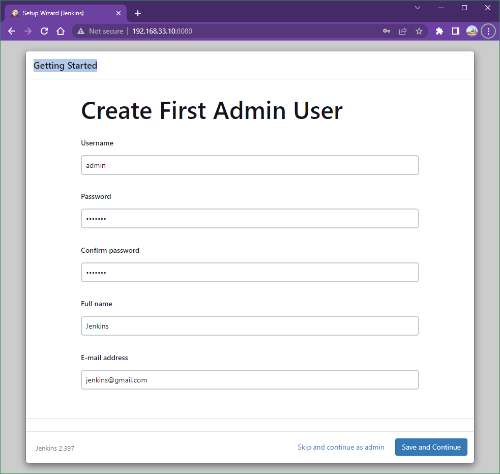

# Lab 008: Install Jenkins Using Ansible

Windows + Ubuntu

## Lab goal

In this lab, we will learn how to use Ansible to install Jenkins.

## Prerequisites

### 1. Install Vagrant for Windows

Because we can't install ansible for Windows directly.

1 Vagrant VM will be installed ansible.

### 2. Create a Vagrant VMs

### 3. Install Ansible for Ubuntu (in the 2nd Vagrant VM)

```bash
sudo apt update
sudo apt upgrade
sudo apt install ansible
ansible --version
```

## Steps

### 1. Run Ansible Playbook

> Note: Before we run the Ansible Playbook, we need to SSH into the Vagrant VM created above and accept the finger print. If we don't do this, then we may encounter errors when we try and run the Ansible Playbook

```bash
ssh-keygen -t rsa -b 4096

ssh-copy-id admin@192.168.33.10

ssh admin@192.168.33.10 
exit

eval "$(ssh-agent -s)"

ls ~/.ssh/id_*

ssh-add ~/.ssh/id_rsa

ssh-add -l
```

<!--
```bash
DevOps 🚀 devbox % ssh-copy-id admin@192.168.33.10
/usr/bin/ssh-copy-id: INFO: Source of key(s) to be installed: "/Users/x239757/.ssh/id_rsa.pub"
/usr/bin/ssh-copy-id: INFO: attempting to log in with the new key(s), to filter out any that are already installed
/usr/bin/ssh-copy-id: INFO: 1 key(s) remain to be installed -- if we are prompted now it is to install the new keys
admin@192.168.33.10's password: 
Permission denied, please try again.
admin@192.168.33.10's password: 

Number of key(s) added:        1

Now try logging into the machine, with:   "ssh 'admin@192.168.33.10'"
and check to make sure that only the key(s) we wanted were added.

DevOps 🚀 devbox % ssh admin@192.168.33.10 
Welcome to Ubuntu 20.04.6 LTS (GNU/Linux 5.4.0-42-generic x86_64)

 * Documentation:  https://help.ubuntu.com
 * Management:     https://landscape.canonical.com
 * Support:        https://ubuntu.com/advantage
New release '22.04.2 LTS' available.
Run 'do-release-upgrade' to upgrade to it.

Last login: Sun Apr  2 15:29:13 2023 from 192.168.33.1
$ exit
Connection to 192.168.33.10 closed.
DevOps 🚀 devbox % 
```
-->

We can run below **ad-hoc** command to make sure the Ansible is able to talk to the VM:

```bash
git clone https://github.com/briansu2004/udemy-devops-real-projects.git
cd udemy-devops-real-projects/008-AnsibleVagrantJenkinsDeployment
ansible -i hosts.ini jenkins_vm -m ping 
```

<!--
> Note: If we are using other VM instead of Vagrant, we need to update the IP in `hosts.ini`
-->

We should get below response if it is successful.

```bash
jenkins_vm | SUCCESS => {
    "ansible_facts": {
        "discovered_interpreter_python": "/usr/bin/python3"
    },
    "changed": false,
    "ping": "pong"
}
```

Run below Ansible playbook script:

```bash
sudo apt-get install sshpass

ansible-playbook install-jenkins.yml -i hosts.ini --ask-pass --ask-become-pass
```

<!--
> Note: The password is stored in `Vagrantfile` for `admin` user if we are using Vagrant as VM. The default is `admin123`. We should see below output if the installation is successful.
-->

Below output when the deployment is done:

```bash
SSH password: 
BECOME password[defaults to SSH password]: 

PLAY [jenkins_vm] **************************************************************************************
...
PLAY RECAP *********************************************************************************************
jenkins_vm                 : ok=6    changed=4    unreachable=0    failed=0    skipped=0    rescued=0    ignored=0  
```

<!--
```bash
vagrant@vagrant:~/udemy-devops-real-projects/008-AnsibleVagrantJenkinsDeployment$ ansible-playbook install-jenkins.yml -i hosts.ini --ask-pass --ask-become-pass
SSH password: 
BECOME password[defaults to SSH password]:

PLAY [jenkins_vm] ************************************************************************************************************************
TASK [Gathering Facts] *******************************************************************************************************************ok: [jenkins_vm]

TASK [Download Jenkins key] **************************************************************************************************************ok: [jenkins_vm]

TASK [Add Apt source list] ***************************************************************************************************************ok: [jenkins_vm]

TASK [Run apt-get update] ****************************************************************************************************************ok: [jenkins_vm]

TASK [Install fontconfig] ****************************************************************************************************************ok: [jenkins_vm]

TASK [Install Java] **********************************************************************************************************************ok: [jenkins_vm]

TASK [Install Jenkins] *******************************************************************************************************************changed: [jenkins_vm]

PLAY RECAP *******************************************************************************************************************************jenkins_vm                 : ok=7    changed=1    unreachable=0    failed=0    skipped=0    rescued=0    ignored=0
```
-->

### 3. Unlocking Jenkins

When we first access the new Jenkins install, we are asked to unlock it using an automatically-generated password.

a. **Browse** to <http://192.168.33.10:8080> and wait until the Unlock Jenkins page appears.

b. Run `sudo cat /var/lib/jenkins/secrets/initialAdminPassword` in the Vagrant VM or any other VM we installed the Jenkins and enter the password showed and click "Next".

c. Click **"Install suggested plugins"** and wait for all plugins are installed.

d. Fill out the info for our First **Amdin User**.

- **Username:** admin
- **Password:** test123  
- **Confirm password:** test123
- **Full name:** Jenkins
- **E-mail address:** jenkins@gmail.com

Click **"Save and Continue"**



e. Click **"Save and Finish"** and click **"Start using Jenkins"**. Then we should login as the admin user we just created previously

<!--
### 4. Using Ansibel Role

We are **done** with the Jenkins via Ansible.

Now, we are going to use **Ansible Role** to install the Jenkins instead. **Ansible Role** are consists of many playbooks and it is a way to group multiple tasks together into one container to do automation in very effective manner with clean directory structures. It can be easily reuse the codes by anyone if it it is suitable.

Before that, we can uninstall the Jenkins/Java package in the Vagrant VM, if we are going to use the same VM.

We are going to apply the Ansible Playbook `uninstall-jenkins.yaml` to remove the related packages before we start the new deployment:

```bash
ansible-playbook uninstall-jenkins.yml -i hosts.ini --ask-pass --ask-become-pass
```

```bash
vagrant@vagrant:~/udemy-devops-real-projects/008-AnsibleVagrantJenkinsDeployment$ ansible-playbook uninstall-jenkins.yml -i hosts.ini --ask-pass --ask-become-pass
SSH password: 
BECOME password[defaults to SSH password]:

PLAY [jenkins_vm] ************************************************************************************************************************
TASK [Gathering Facts] *******************************************************************************************************************ok: [jenkins_vm]

TASK [Uninstall Jenkins] *****************************************************************************************************************changed: [jenkins_vm]

TASK [Uninstall Java] ********************************************************************************************************************changed: [jenkins_vm]

PLAY RECAP *******************************************************************************************************************************jenkins_vm                 : ok=3    changed=2    unreachable=0    failed=0    skipped=0    rescued=0    ignored=0
```

Run below command to download the Jenkins Role from **Ansible Galaxy**:

```bash
ansible-galaxy install geerlingguy.jenkins -i hosts.ini --ask-pass --ask-become-pass
```

```bash
vagrant@vagrant:~/udemy-devops-real-projects/008-AnsibleVagrantJenkinsDeployment$ ansible-galaxy install geerlingguy.jenkins
- downloading role 'jenkins', owned by geerlingguy
- downloading role from https://github.com/geerlingguy/ansible-role-jenkins/archive/5.0.1.tar.gz
- extracting geerlingguy.jenkins to /home/vagrant/.ansible/roles/geerlingguy.jenkins
- geerlingguy.jenkins (5.0.1) was installed successfully
```

The role will be installed under `~/.ansible/roles`

```bash
cd ~/.ansible/roles/geerlingguy.jenkins
ls
defaults  handlers  LICENSE  meta  molecule  README.md  tasks  templates  tests  vars
```

Roles expect files to be in certain directory names. Each directory must contain a `main.yml` file. Below is a describption of each directory.

- **tasks** - Contains the main list of tasks to be executed by the role
- **handlers** - contains handlers, which may be used by this role or even anywhere outside this role
- **defaults** - default variables for the role
- **vars** - other variables for the role.
- **files** - containers file which can be deployed via this role
- **templates** - contains templates which can be deployed via this role.
- **meta** - defines some meta data for this role.

Run below command to apply the **Ansible Role**:

```bash
ansible-playbook install-jenkins-role.yml -i hosts.ini --ask-pass --ask-become-pass
```
-->
