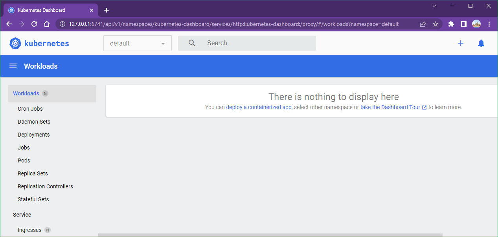
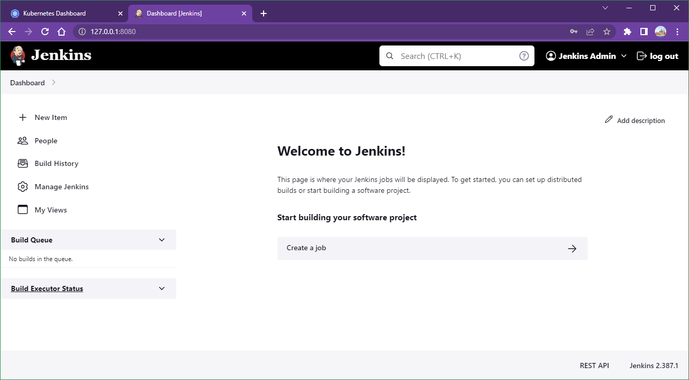
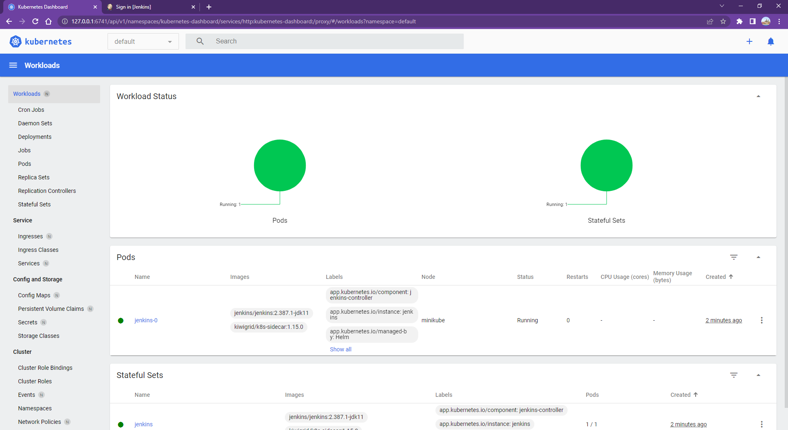

# Lab 009: Helm Deployment in Kubernetes

## Lab goal

In this lab, we will learn how to deploy a Jenkins via Helm Chart in Kubernetes.

## Prerequisites

### 1. Install Docker for Windows

### 2. Install Minikube for Windows

`choco install minikube`

<!--
[Minikube official website](https://minikube.sigs.k8s.io/docs/start/)
-->

### 3. Install Helm for Windows

`choco install kubernetes-helm`

<!--
> ref: <https://helm.sh/docs/intro/install/>

```dos
curl https://raw.githubusercontent.com/kubernetes/helm/master/scripts/get-helm-3 > get_helm.sh
chmod 700 get_helm.sh
./get_helm.sh
```
-->

## Steps

### 1. Start Minikube

Start the minikube:

```dos
minikube start
minikube status
```

Download kubectl

<!--
[k8s official website](https://kubernetes.io/docs/tasks/tools/)
-->

```dos
minikube kubectl
```

<!--
alias k="kubectl"
-->

When we run the command `kubectl get node`, we should see below output:

```dos
NAME       STATUS   ROLES           AGE     VERSION
minikube   Ready    control-plane   4m37s   v1.25.3
```

### 2. Enable Minikube Dashboard

We can also enable our **Minikube dashboard** by running below command:

```dos
minikube dashboard
```

We should see a Kuberentes Dashboard page pop out in the browser immediately.

We can explore all Minikube resources in this UI website.



### 3. Add Helm Repo

<!--
Clean up:

```dos
helm uninstall jenkins
helm repo remove jenkins
helm repo list
```

-->

Add the helm repo as follows:

```dos
helm repo add jenkins https://charts.jenkins.io
helm repo update
```

### 4. Install Jenkins Helm Chart

Helm uses a packaging format called **charts**.

A **chart** is a collection of files that describe a related set of Kubernetes resources, such as deployment, statefulset, secret, configmap, etc.

We are going to download/install the chart from the **jenkins** repo:

```dos
helm install jenkins jenkins/jenkins 
```

You can check the logs by running below command:

```dos
minikube logs -f
```

### 5. Access Jenkins Website

Now, we have deployed a Jenkins service in the Minikube. You can check if the Jenkins pod is in `Running` state

```dos
kubectl get pod
```

If so, **forward** the port to our local and then we can access the Jenkins website

```dos
kubectl --namespace default port-forward svc/jenkins 8080:8080
```

Open our **browser** and type `http://127.0.0.1:8080`

<!--
`http://0.0.0.0:8080`
-->

The username is `admin`.

The password can be retireved with this command.:

```dos
kubectl exec --namespace default -it svc/jenkins -c jenkins -- cat /run/secrets/additional/chart-admin-password
```

<!--
```bash
kubectl exec --namespace default -it svc/jenkins -c jenkins -- /bin/cat /run/secrets/additional/chart-admin-password && echo
```

PS C:\devbox> kubectl exec --namespace default -it svc/jenkins -c jenkins -- cat /run/secrets/additional/chart-admin-password
1J9EViPpHcvFrF0dLSQrSc
-->



Minikue dashboard:



<!--

# Create Your Own Helm Chart

In above lab, we went through the steps to deploy an app via Helm Chart in K8s. In practical, we may need to create our own helm chart to deploy our own developed code.In the following article, we will create a **customized helm chart** and store it in the **GitHub page**.

## 1. Create our own Github repo

You can refer to [here](https://docs.github.com/en/get-started/quickstart/create-a-repo) for how to **create a repo** in the Github.

## 2. Create a Helm Chart

In our repo created above, run below commands to **create a Helm Chart**

```
mkdir helm-charts
cd helm-charts
helm create test-service
```

Then we will see a folder `test-service` is created. Below is the structure in the folder

```
$ tree test-service/
test-service/
├── charts
├── Chart.yaml
├── templates
│   ├── deployment.yaml
│   ├── _helpers.tpl
│   ├── hpa.yaml
│   ├── ingress.yaml
│   ├── NOTES.txt
│   ├── serviceaccount.yaml
│   ├── service.yaml
│   └── tests
│       └── test-connection.yaml
└── values.yaml

```

**charts:** Charts that this chart depends on. You can define the **dependencies** in `Chart.yaml`</br>
**Chart.yaml:** Information about our chart</br>
**templates:** All template manifest files</br>
**values.yaml:** The default values for our templates</br>
You can modify this Helm Chart files as we need.

## 3. Package and upload our Helm Chart

You need to package our Helm Chart into `tgz` file and upload to the Github.

```dos
helm package test-service
```

The `tgz` file should be generated

```dos
$ ls
test-service  test-service-0.1.0.tgz
```

Create the `index.yaml` file

```dos
helm repo index --url https://<your_github_account>.github.io/<repo_name> ./

# i.g.
helm repo index --url https://devops2021.github.io/devopsdaydayup ./
$ ls
index.yaml  test-service  test-service-0.1.0.tgz
```

Create a `docs` in the root directory and move both `index.yaml` and `test-service-0.1.0.tgz` into it

```dos
cd ..
mkdir docs
mv helm-charts/{index.yaml,test-service-0.1.0.tgz} docs
```

**Commit** the changes to our Github repo

```dos
git add .
git commit -m "Helm Chart"
git push
```

## 4. Create Github Pages

In order to make our `tgz` downloadable from our Github site, we need to enable our Github Pages. </br>
a. Go to our Github site and head into **our repo** which is planning to be used to hold our Helm Chart.</br>
b. Go to **"Settings"** and click "Pages" in the left lane. </br>
c. In the **Branch** section, select "main" and "/docs". </br>
d. Click "Save" to apply the change. </br>
Once the Github Page is setup, we should be able to download the `tgz` file from the site. The URL should be like `https://<your_github_username>.github.io/<your_repo_name>`


## 5. Deploy our own Helm Chart

Now we are ready to deploy our own created Helm Chart! </br>
**Add the Helm repository** locally

```
helm repo add myrepo https://<your_github_username>.github.io/<your_repo_name>

# i.g.
$ helm repo add myrepo https://devops2021.github.io/devopsdaydayup
"myrepo" has been added to our repositories
```

**Install** this Helm Chart into our Minikube

```
helm install test-service myrepo/test-service
```

You should see below **output** once the deployment is successful

```dos
NAME: test-service
LAST DEPLOYED: Sat Dec 10 19:52:20 2022
NAMESPACE: default
STATUS: deployed
REVISION: 1
NOTES:
1. Get the application URL by running these commands:
  export POD_NAME=$(kubectl get pods --namespace default -l "app.kubernetes.io/name=test-service,app.kubernetes.io/instance=test-service" -o jsonpath="{.items[0].metadata.name}")
  export CONTAINER_PORT=$(kubectl get pod --namespace default $POD_NAME -o jsonpath="{.spec.containers[0].ports[0].containerPort}")
  echo "Visit http://127.0.0.1:8080 to use our application"
  kubectl --namespace default port-forward $POD_NAME 8080:$CONTAINER_PORT
```
-->
