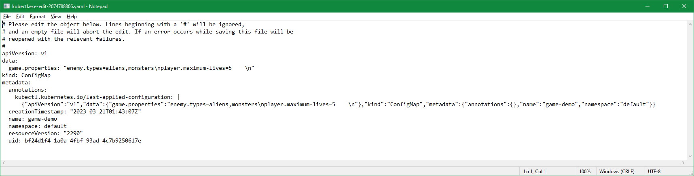
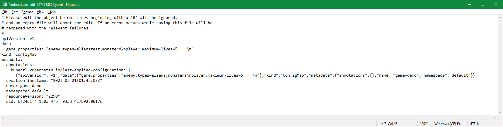
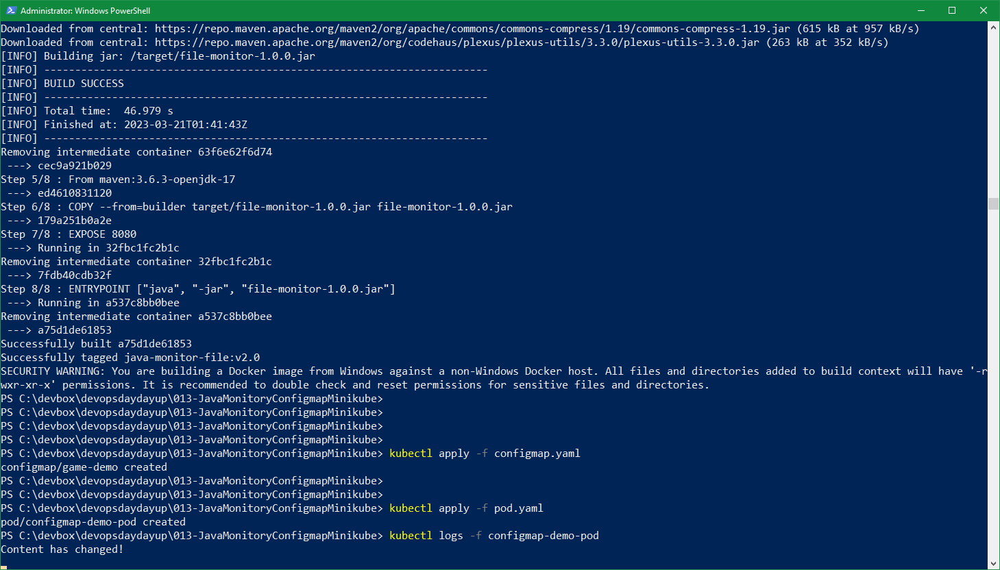

# Project Name: Develop a Java Application in K8s for Monitoring ConfigMap Modifications and Content Changes

Windows Only

<!--
Windows + Ubuntu (vagrant vbox)
-->

## Project Goal

In this lab, you will learn how to develop a Java application that interacts with the Kubernetes API to **monitor changes** to a file that is mounted by a **ConfigMap**.

It is important to note that **the file mounted by the ConfigMap is mounted as a symbolic link** (e.g. `/config/game.properties` -> `/config/..data/game.properties`-> `/config/..2023_03_02_15_51_59.1603915861/game.properties`), so your Java code should read the **symlink** instead of the file directly.

## Steps

### 1. Start Docker

Minikube needs Docker.

### 2. Start Minikube

You can install the **Minikube** by following the instruction in the [Minikube official website](https://minikube.sigs.k8s.io/docs/start/). Once it is installed, start the minikube by running below command:

```dos
minikube start
minikube status
```

<!--
```dos
PS C:\devbox> minikube start
* minikube v1.29.0 on Microsoft Windows 10 Enterprise 10.0.19044.2604 Build 19044.2604
* Using the docker driver based on existing profile
* Starting control plane node minikube in cluster minikube
* Pulling base image ...
* Restarting existing docker container for "minikube" ...
* Preparing Kubernetes v1.26.1 on Docker 20.10.23 ...
* Configuring bridge CNI (Container Networking Interface) ...
* Verifying Kubernetes components...
  - Using image gcr.io/k8s-minikube/storage-provisioner:v5
  - Using image docker.io/kubernetesui/dashboard:v2.7.0
  - Using image docker.io/kubernetesui/metrics-scraper:v1.0.8
* Some dashboard features require the metrics-server addon. To enable all features please run:

        minikube addons enable metrics-server

* Enabled addons: storage-provisioner, default-storageclass, dashboard
* Done! kubectl is now configured to use "minikube" cluster and "default" namespace by default

PS C:\devbox> minikube status
minikube
type: Control Plane
host: Running
kubelet: Running
apiserver: Running
kubeconfig: Configured
```
-->

Once the Minikube starts, you can download the **kubectl** from [k8s official website](https://kubernetes.io/docs/tasks/tools/)

```dos
minikube kubectl
```

<!--
alias k="kubectl"
-->

Then, when you run the command `kubectl get node` or `k get node`, you should see below output:

```dos
NAME       STATUS   ROLES           AGE     VERSION
minikube   Ready    control-plane   4m37s   v1.25.3
```

<!--
```dos
PS C:\devbox> kubectl get node
NAME       STATUS   ROLES           AGE    VERSION
minikube   Ready    control-plane   2d4h   v1.26.1
```
-->

### 2. Build Image

Run below command to **build** the image:

```dos
git clone https://github.com/briansu2004/udemy-devops-real-projects.git
cd udemy-devops-real-projects\013-JavaMonitoryConfigmapMinikube
docker build -t java-monitor-file:v2.0 .
```

<!--
```dos
git clone https://github.com/chance2021/devopsdaydayup.git
cd 013-JavaMonitoryConfigmapMinikube
eval $(minikube docker-env)
docker build -t java-monitor-file:v2.0 .
```
-->

<!--
```dos
PS C:\devbox> minikube docker-env
$Env:DOCKER_TLS_VERIFY = "1"
$Env:DOCKER_HOST = "tcp://127.0.0.1:2775"
$Env:DOCKER_CERT_PATH = "C:\Users\x239757\.minikube\certs"
$Env:MINIKUBE_ACTIVE_DOCKERD = "minikube"
# To point your shell to minikube's docker-daemon, run:
# & minikube -p minikube docker-env --shell powershell | Invoke-Expression
```

```dos
...
[INFO] Building jar: /target/file-monitor-1.0.0.jar
[INFO] ------------------------------------------------------------------------
[INFO] BUILD SUCCESS
[INFO] ------------------------------------------------------------------------
[INFO] Total time:  46.979 s
[INFO] Finished at: 2023-03-21T01:41:43Z
[INFO] ------------------------------------------------------------------------
Removing intermediate container 63f6e62f6d74
 ---\> cec9a921b029
Step 5/8 : From maven:3.6.3-openjdk-17
 ---\> ed4610831120
Step 6/8 : COPY --from=builder target/file-monitor-1.0.0.jar file-monitor-1.0.0.jar
 ---\> 179a251b0a2e
Step 7/8 : EXPOSE 8080
 ---\> Running in 32fbc1fc2b1c
Removing intermediate container 32fbc1fc2b1c
 ---\> 7fdb40cdb32f
Step 8/8 : ENTRYPOINT ["java", "-jar", "file-monitor-1.0.0.jar"]
 ---\> Running in a537c8bb0bee
Removing intermediate container a537c8bb0bee
 ---\> a75d1de61853
Successfully built a75d1de61853
Successfully tagged java-monitor-file:v2.0
SECURITY WARNING: You are building a Docker image from Windows against a non-Windows Docker host. All files and directories added to build context will have '-rwxr-xr-x' permissions. It is recommended to double check and reset permissions for sensitive files and directories.
```
-->

### 2. Deploy ConfigMap

```dos
kubectl apply -f configmap.yaml
```

<!--
```dos
PS C:\devbox\devopsdaydayup\013-JavaMonitoryConfigmapMinikube> kubectl apply -f configmap.yaml
configmap/game-demo created
```
-->

### 3. Deploy Pod

```dos
kubectl apply -f pod.yaml
```

<!--
```dos
PS C:\devbox\devopsdaydayup\013-JavaMonitoryConfigmapMinikube> kubectl apply -f pod.yaml
pod/configmap-demo-pod created
```
-->

### 4. Verification

You can modify the contents of the ConfigMap and verify if the activity is captured in the log. First **stream the log**:

```dos
kubectl logs -f configmap-demo-pod
```

Then open another terminal to **modify the ConfigMap**

```dos
kubectl edit cm game-demo
```

**Update** anything within below **data** section

From

```dos
data:
  game.properties: "enemy.types=aliens,monsters\nplayer.maximum-lives=5\\n"
```

To

```dos
data:
  game.properties: "enemy.types=alienstest,monsters\nplayer.maximum-lives=5\\n"
```



->



<!--
```dos
PS C:\devbox> kubectl edit cm game-demo
configmap/game-demo edited
```
-->

Then wait for about 1 min and you should see below message in the log

```dos
$ kubectl logs -f configmap-demo-pod

Content has changed!
```

<!--
```dos
PS C:\devbox\devopsdaydayup\013-JavaMonitoryConfigmapMinikube> kubectl logs -f configmap-demo-pod
Content has changed!
```
-->

<!--
> Note: You can also update `spec.containers.args` in `pod.yaml` if you would like to monitor another file path.
-->


