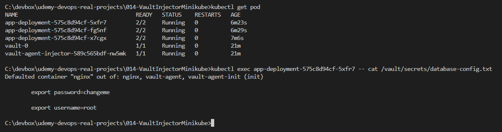

# Lab 014: Deploy and Use Vault As Agent Sidecar Injector

Windows only

## Lab goal

In this lab, we will learn how to deploy a Jenkins via Helm Chart in Kubernetes.

## Prerequisites

### 1. Install Docker for Windows

### 2. Install Minikube for Windows

<!--
```dos
minikube stop
minikube delete
```
-->

```dos
minikube start --driver=docker --kubernetes-version=v1.26.1
```

### 3. Install Helm for Windows

## Steps

### 1. Add Helm Repo

To use the Helm chart, **add the Hashicorp helm repository** and check that we have access to the chart:

```dos
helm repo add hashicorp https://helm.releases.hashicorp.com
helm repo update
```

### 2. Deploy Vault Helm Chart

**Install** the latest release of the Vault Helm chart with below command:

```dos
git clone https://github.com/briansu2004/udemy-devops-real-projects.git
cd udemy-devops-real-projects\014-VaultInjectorMinikube
helm install vault hashicorp/vault -f values_windows.yaml
```

### 3. Setup Vault

a. **Initiate** vault

```bash
kubectl get pod

kubectl exec -it "vault-0" -- sh

vault operator init
```

<!--
```bash

```
-->

**Note:**

Make a note of the output. This is the only time ever we see those **unseal keys** and **root token**. If we lose it, we won't be able to seal vault any more.

b. **Unsealing** the vault

Type `vault operator unseal <unseal key>`. The unseal keys are from previous output. we will need at lease **3 keys** to unseal the vault.

When the value of  `Sealed` changes to **false**, the Vault is unsealed. we should see below similar output once it is unsealed

c. Sign in to Vault with **root** user

Type `vault login` and enter the `<Initial Root Token>` retrieving from previous output

### 4. Enable Vault KV Secrets Engine Version 2 and Create a Secret

<!--
> Refer to <https://developer.hashicorp.com/vault/docs/secrets/kv/kv-v2>
-->

```dos
vault secrets enable -path=internal-app kv-v2

vault kv put internal-app/database/config username=root password=changeme
```

We can **read** the data by running this:

```dos
vault kv get internal-app/database/config
```

Then we should be able to see below output

```dos
====== Data ======
Key         Value
---         -----
password    changeme
username    root
```

### 5. Configure Kubernetes authentication

Stay on the Vault pod and configure the kuberentes authentication

a. **Enable** the Kuberetes auth in the Vault

```dos
vault auth enable kubernetes
```

b. Create a **role** for the service account which is used by the deployment

```dos
vault write auth/kubernetes/config kubernetes_host="https://$KUBERNETES_PORT_443_TCP_ADDR:443"

vault policy write internal-app - <<EOF
path "internal-app/data/database/config" {
  capabilities = ["read"]
}
EOF
```

<!--
```bash
vault policy list
vault policy read internal-app
```
-->

<!--
> Note: Since version 2 kv has prefixed `data/`, our secret path will be `internal-app/data/database/config`, instead of `internal-app/database/config`
-->

c. Associate the role created above to the **service account**

```dos
vault write auth/kubernetes/role/internal-app \
    bound_service_account_names=app-sa \
    bound_service_account_namespaces=default \
    policies=internal-app \
    ttl=24h
```

### 6. Launch an application

Apply the `app-deployment.yaml` to deploy a deployment:

```dos
kubectl apply -f app-deployment.yaml
```

Wait for the pods are **ready**

```dos
kubectl wait pods -n default -l app=nginx --for condition=Ready --timeout=1000s
```

### 7. Update the deployment to enable the Vault Injection

To enable the vault to inject secrets into a deployment's pods, we need to patch the code in `patch-app-deployment.yaml` into the **annotation** section of the deployment file:

<!--
Power Shell has issues!

```dos
kubectl patch deployment app-deployment --patch (Get-Content patch-app-deployment.yaml | Out-String)
```
-->

Git bash

```bash
kubectl patch deployment app-deployment --patch "$(cat patch-app-deployment.yaml)"
```

==>

Once the vault sidecar is successfully injected into the app deployment's pod, we should be able to verify its presence by inspecting the pod's configuration.

```dos
kubectl get pod

kubectl exec <any app-deployment pod name> -- cat /vault/secrets/database-config.txt
```

Result:

<!--
```dos
C:\devbox\udemy-devops-real-projects\014-VaultInjectorMinikube>kubectl get pod
NAME                                    READY   STATUS    RESTARTS   AGE
app-deployment-575c8d94cf-5xfr7         2/2     Running   0          5m10s
app-deployment-575c8d94cf-fg5nf         2/2     Running   0          5m16s
app-deployment-575c8d94cf-x7cgx         2/2     Running   0          5m53s
vault-0                                 1/1     Running   0          20m
vault-agent-injector-589c565bdf-nw5mk   1/1     Running   0          20m

C:\devbox\udemy-devops-real-projects\014-VaultInjectorMinikube>kubectl exec app-deployment-575c8d94cf-5xfr7 -- cat /vault/secrets/database-config.txt
Defaulted container "nginx" out of: nginx, vault-agent, vault-agent-init (init)

        export password=changeme

        export username=root

C:\devbox\udemy-devops-real-projects\014-VaultInjectorMinikube>kubectl exec app-deployment-575c8d94cf-fg5nf -- cat /vault/secrets/database-config.txt 
Defaulted container "nginx" out of: nginx, vault-agent, vault-agent-init (init)

        export password=changeme

        export username=root    

C:\devbox\udemy-devops-real-projects\014-VaultInjectorMinikube>kubectl exec app-deployment-575c8d94cf-x7cgx -- cat /vault/secrets/database-config.txt 
Defaulted container "nginx" out of: nginx, vault-agent, vault-agent-init (init)

        export password=changeme

        export username=root    
```
-->


