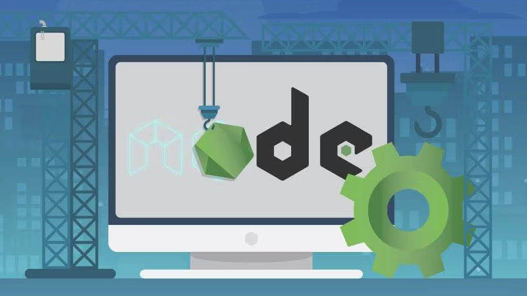
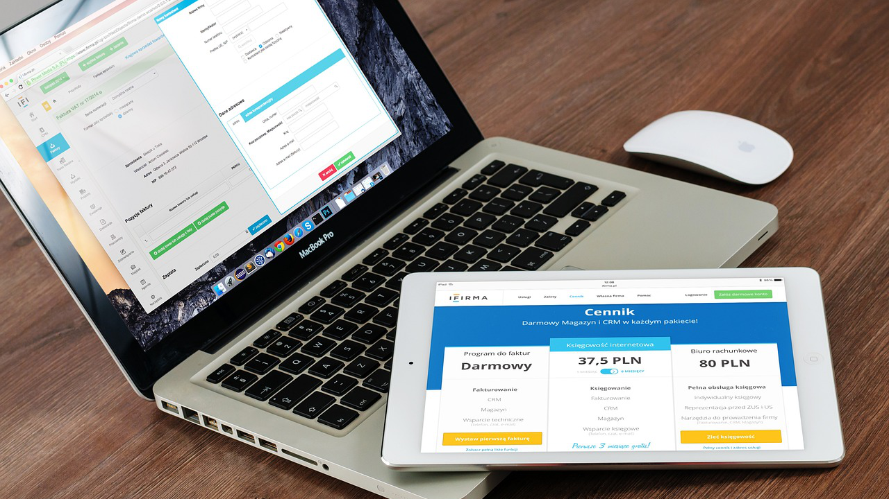
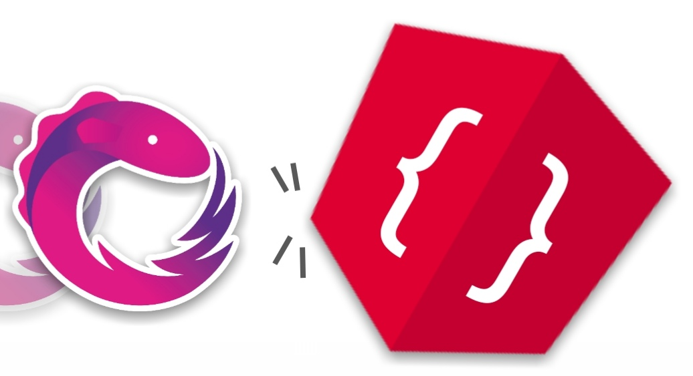
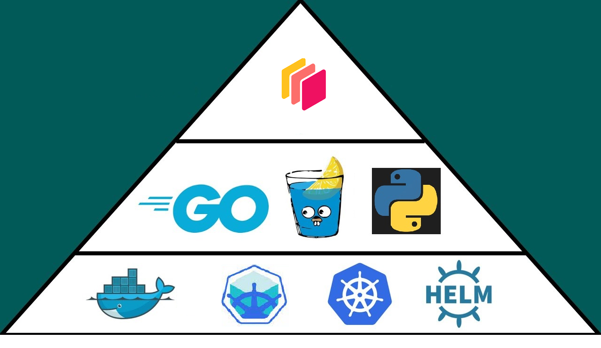
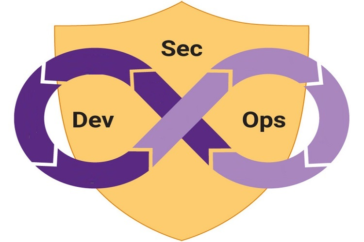
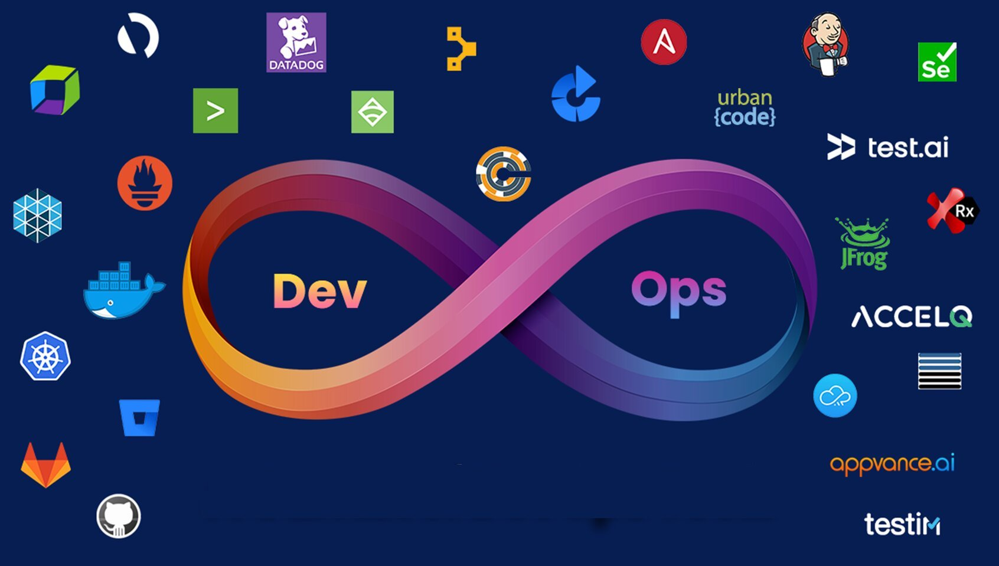
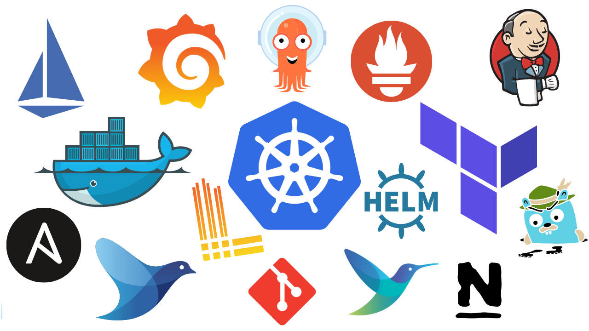

# DevOps Labs: Real DevOps Projects

Enjoy 😀

## Courses

<!-- - [Ace Angular Job Interviews](https://www.udemy.com/course/ace-angular)

 -->

- [Nail Node.js Job Interviews](https://www.udemy.com/course/nail-nodejs)

- [Guru Golang Job Interviews](https://www.udemy.com/course/guru-golang/)

- [Mendix Magic: Mobilize Your Responsive Apps with No Code](https://www.udemy.com/course/mendix-magic/)

- [Spring MVC Mastery: Jumpstart Your Java Projects](https://www.udemy.com/course/spring-mvc-mastery-jumpstart-your-java-projects/)

- [Struts Savvy: Quickstart Your Java Projects](https://www.udemy.com/course/struts-savvy-quickstart-your-java-projects/)

- [React Mastery: Rapidstart Your Responsive App](https://www.udemy.com/course/react-rapidstart-creating-an-responsive-react-app-in-1-hour)

- [Maven Mastery: Kickstart Your Java Projects](https://www.udemy.com/course/maven-mastery-kickstart-your-java-projects/)

- [Ace Your Google Cloud (GCP) Job Interviews (2023)](https://www.udemy.com/course/it-contractor-google-cloud-gcp-interview-questions-20xx)

<!-- - [IT Contractor Angular Interview Questions (2023)](https://www.udemy.com/course/it-contractor-angular-interview-questions-20xx/)

- [IT Contractor .Net and C# Interview Questions (2023)](https://www.udemy.com/course/it-contractor-net-and-c-interview-questions-20xx)

 -->

- [IT Contractor Interview Questions (2023)](https://www.udemy.com/course/it-contractor-interview-questions-20xx)

- [IT Contractor Behavioral Interview Questions (2023)](https://www.udemy.com/course/it-contractor-behavioral-interview-questions-20xx/)

- [DevOps Interview Questions (2023)](https://www.udemy.com/course/devops-interview-questions-20xx)

- [Managing Dask Kubernetes with Kubectl, Python and Go](https://www.udemy.com/course/managing-dask-kubernetes-with-kubectl-python-and-go)

- [DevOps Labs: 16 Real DevOps Projects](https://www.udemy.com/course/devops-labs-16-real-devops-projects/)

- [DevOps Labs: 15 Real DevSecOps Projects](https://www.udemy.com/course/devops-labs-15-real-devsecops-projects/)

- [DevOps Labs: 14 Real DevOps Projects](https://www.udemy.com/course/devops-labs-14-real-devops-projects/)

- [DevOps Labs: 12 Real DevSecOps Projects](https://www.udemy.com/course/devops-labs-12-real-devsecops-projects/)

- [DevOps Labs: 9 Real DevOps Projects](https://www.udemy.com/course/devops-labs-9-real-devops-projects/)

- [DevOps Labs: 6 Real DevOps Projects](https://www.udemy.com/course/devops-labs-6-real-devops-projects/)

- [DevOps Labs: 3 Real DevOps Projects](https://www.udemy.com/course/devops-labs-9-real-devops-projects-free-version/)

## Labs

Lab 001: ELK Monitoring

Lab 002: Jenkins CICD Pipeline

Lab 003: Gitlab CICD Pipeline

Lab 004: Deploy Docker with Terraform Script

Lab 005: Vault Jenkins Pipeline

Lab 006: Push War file to Nexus Repository Via Jenkins Pipeline and Deploy to Tomcat in Vagrant VM

Lab 007: Managing SSH Access with Vault

Lab 008: Install Jenkins Using Ansible

Lab 009: Helm Deployment in Kubernetes

Lab 011: Create Read Only Kubeconfig File

Lab 012: Backup Vault in Minio

Lab 013: Develop a Java Application in K8s for Monitoring ConfigMap Modifications and Content Changes

Lab 014: Deploy and Use Vault As Agent Sidecar Injector

Lab 015: Remove Large File from Git Commit History

Lab 016: Deploy an Go API app to Azure With ACR and AKS
