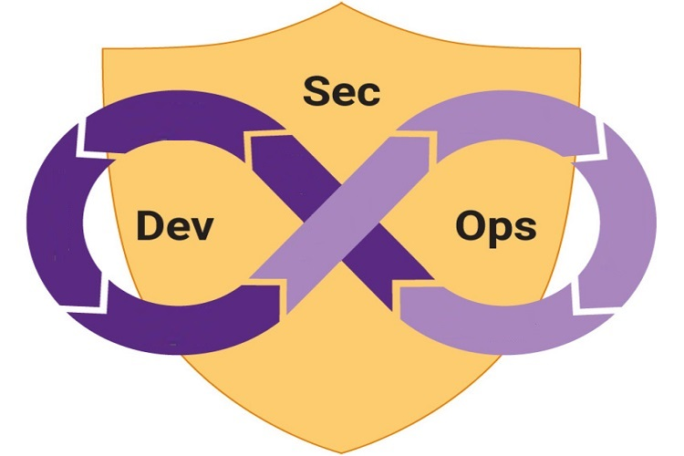
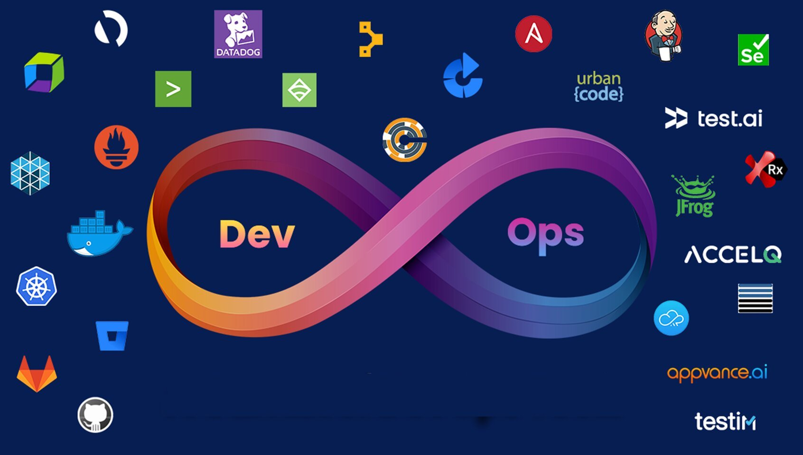

# DevOps Labs: Real DevOps Projects

Enjoy 😀

## Courses

- [DevOps Labs: 16 Real DevOps Projects](https://www.udemy.com/course/devops-labs-16-real-devops-projects/)

- [DevOps Labs: 15 Real DevSecOps Projects](https://www.udemy.com/course/devops-labs-15-real-devsecops-projects/)

- [DevOps Labs: 14 Real DevOps Projects](https://www.udemy.com/course/devops-labs-14-real-devops-projects/)

- [DevOps Labs: 12 Real DevSecOps Projects](https://www.udemy.com/course/devops-labs-12-real-devsecops-projects/)

- [DevOps Labs: 9 Real DevOps Projects](https://www.udemy.com/course/devops-labs-9-real-devops-projects/)

- [DevOps Labs: 6 Real DevOps Projects](https://www.udemy.com/course/devops-labs-6-real-devops-projects/)

- [DevOps Labs: 3 Real DevOps Projects](https://www.udemy.com/course/devops-labs-9-real-devops-projects-free-version/)

## Labs

Lab 001: ELK Monitoring

Lab 002: Jenkins CICD Pipeline

Lab 003: Gitlab CICD Pipeline

Lab 004: Deploy Docker with Terraform Script

Lab 005: Vault Jenkins Pipeline

Lab 006: Push War file to Nexus Repository Via Jenkins Pipeline and Deploy to Tomcat in Vagrant VM

Lab 007: Managing SSH Access with Vault

Lab 008: Install Jenkins Using Ansible

Lab 009: Helm Deployment in Kubernetes

Lab 011: Create Read Only Kubeconfig File

Lab 012: Backup Vault in Minio

Lab 013: Develop a Java Application in K8s for Monitoring ConfigMap Modifications and Content Changes

Lab 014: Deploy and Use Vault As Agent Sidecar Injector

Lab 015: Remove Large File from Git Commit History

Lab 016: Deploy an Go API app to Azure With ACR and AKS
