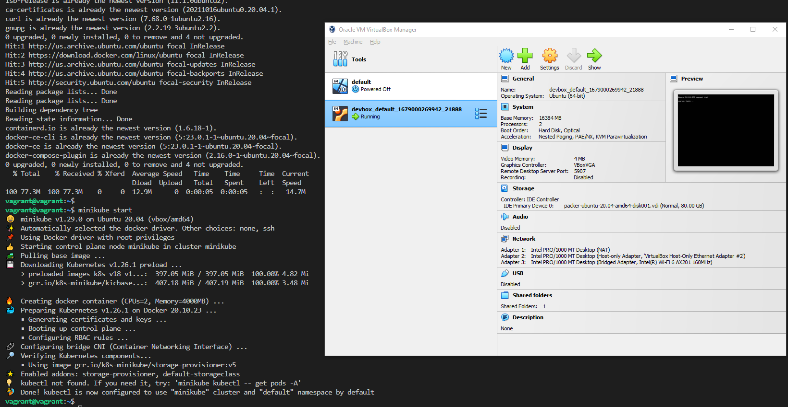

# How to set up Ubuntu

## Install Docker in Ubuntu

<https://docs.docker.com/engine/install/ubuntu/>

```bash
cat > install_docker.sh <<EOF

sudo apt-get update
echo y | sudo apt-get install \
    ca-certificates \
    curl \
    gnupg \
    lsb-release
sudo mkdir -p /etc/apt/keyrings
sudo rm -f /etc/apt/keyrings/docker.gpg
curl -fsSL https://download.docker.com/linux/ubuntu/gpg | sudo gpg --dearmor -o /etc/apt/keyrings/docker.gpg
echo \
  "deb [arch=$(dpkg --print-architecture) signed-by=/etc/apt/keyrings/docker.gpg] https://download.docker.com/linux/ubuntu \
  $(lsb_release -cs) stable" | sudo tee /etc/apt/sources.list.d/docker.list > /dev/null
sudo chmod a+r /etc/apt/keyrings/docker.gpg
sudo apt-get update
echo y | sudo apt-get install docker-ce docker-ce-cli containerd.io docker-compose-plugin
sudo chmod 666 /var/run/docker.sock
EOF

chmod 777 install_docker.sh
./install_docker.sh
```

## Install Docker Compose in Ubuntu

```bash
sudo apt-get install -y docker-compose
```

## Install Ansible in Ubuntu

```bash
sudo apt update
sudo apt upgrade
sudo apt install ansible
ansible --version
```

## Install Terraform in Ubuntu

```bash
sudo apt-get update && sudo apt-get install -y gnupg software-properties-common

wget -O- https://apt.releases.hashicorp.com/gpg | \
gpg --dearmor | \
sudo tee /usr/share/keyrings/hashicorp-archive-keyring.gpg

gpg --no-default-keyring \
--keyring /usr/share/keyrings/hashicorp-archive-keyring.gpg \
--fingerprint

echo "deb [signed-by=/usr/share/keyrings/hashicorp-archive-keyring.gpg] \
https://apt.releases.hashicorp.com $(lsb_release -cs) main" | \
sudo tee /etc/apt/sources.list.d/hashicorp.list

sudo apt update

sudo apt-get install terraform
```

or

```bash
wget -O- https://apt.releases.hashicorp.com/gpg | gpg --dearmor | sudo tee /usr/share/keyrings/hashicorp-archive-keyring.gpg
echo "deb [signed-by=/usr/share/keyrings/hashicorp-archive-keyring.gpg] https://apt.releases.hashicorp.com $(lsb_release -cs) main" | sudo tee /etc/apt/sources.list.d/hashicorp.list
sudo apt update && sudo apt install terraform
```

## Install minikube in Ubuntu

<!--<https://minikube.sigs.k8s.io/docs/start/>-->

Note: need to install docker first

<!--
```dos
curl -LO https://storage.googleapis.com/minikube/releases/latest/minikube-linux-amd64
sudo install minikube-linux-amd64 /usr/local/bin/minikube
```
-->

```bash
cat > install_docker_minikube.sh <<EOF

sudo apt-get update
echo y | sudo apt-get install \
    ca-certificates \
    curl \
    gnupg \
    lsb-release
sudo mkdir -p /etc/apt/keyrings
sudo rm -f /etc/apt/keyrings/docker.gpg
curl -fsSL https://download.docker.com/linux/ubuntu/gpg | sudo gpg --dearmor -o /etc/apt/keyrings/docker.gpg
echo \
  "deb [arch=$(dpkg --print-architecture) signed-by=/etc/apt/keyrings/docker.gpg] https://download.docker.com/linux/ubuntu \
  $(lsb_release -cs) stable" | sudo tee /etc/apt/sources.list.d/docker.list > /dev/null
sudo chmod a+r /etc/apt/keyrings/docker.gpg
sudo apt-get update
echo y | sudo apt-get install docker-ce docker-ce-cli containerd.io docker-compose-plugin
sudo chmod 666 /var/run/docker.sock
curl -LO https://storage.googleapis.com/minikube/releases/latest/minikube-linux-amd64
sudo install minikube-linux-amd64 /usr/local/bin/minikube
minikube start
EOF

chmod 777 install_docker_minikube.sh
./install_docker_minikube.sh
```

Start minikube cluster

```bash
minikube start
```

Check status

```bash
minikube status
```

Download kubectl

```bash
minikube kubectl
```

## Install kubectl in Ubuntu

```bash
curl -s https://packages.cloud.google.com/apt/doc/apt-key.gpg | sudo apt-key add -
echo "deb https://apt.kubernetes.io/ kubernetes-xenial main" | sudo tee /etc/apt/sources.list.d/kubernetes.list
sudo apt-get update
sudo apt-get install -y kubectl
kubectl version --client
```

or with minikube

```bash
minikube kubectl
```

## Install kubenetes in Ubuntu

```bash
sudo apt-get update
sudo apt-get install -y docker.io
sudo apt-get update
sudo apt-get install -y apt-transport-https curl
curl -s https://packages.cloud.google.com/apt/doc/apt-key.gpg | sudo apt-key add -
echo "deb https://apt.kubernetes.io/ kubernetes-xenial main" | sudo tee /etc/apt/sources.list.d/kubernetes.list
sudo apt-get update
sudo apt-get install -y kubelet kubeadm kubectl
sudo apt-mark hold kubelet kubeadm kubectl

```

## Install Helm in Ubuntu

```bash
curl -fsSL -o get_helm.sh https://raw.githubusercontent.com/helm/helm/main/scripts/get-helm-3
chmod 700 get_helm.sh
./get_helm.sh
```

## Install Kind in Ubuntu

```bash
curl -Lo ./kind https://kind.sigs.k8s.io/dl/v0.18.0/kind-linux-amd64
chmod +x ./kind
sudo mv ./kind /usr/local/bin/kind
```

## DNS

Make sure there are valid nameserver entries in `/etc/resolv.conf`

```bash
cat /etc/resolv.conf
```

If not -

```bash
sudo systemctl disable systemd-resolved
sudo systemctl stop systemd-resolved
```

Add below entries to `/etc/resolv.conf`

```bash
nameserver 8.8.8.8 
nameserver 8.8.4.4
```

## ifconfig

```bash
apt update && apt upgrade
apt install net-tools
```

## ping

```bash
apt update && apt upgrade
apt install iputils-ping
```

<!--
## Troubleshooting

### Exiting due to RSRC_INSUFFICIENT_CORES: Requested cpu count 2 is greater than the available cpus of 1



-->

<!--
Clean up:

```bash
docker container ls -a
docker volume ls 
docker image ls 

docker volume ls -q | xargs docker volume rm
```
-->
