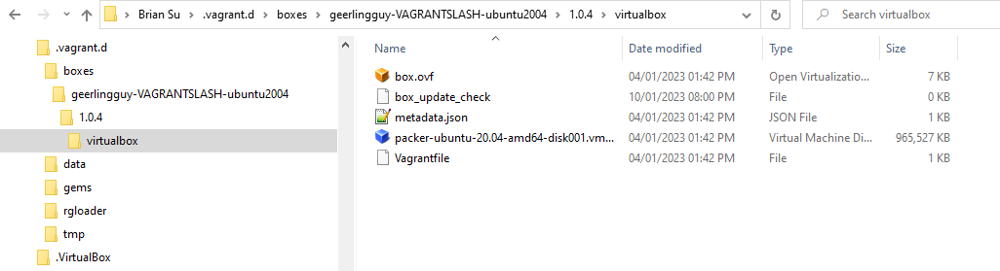

# Vagrant

## Install Vagrant

### Install Vagrant in Windows

### Install Vagrant in Mac

## Install VirtualBox (aka VBox)

### Install VirtualBox in Windows

### Install VirtualBox in Mac

## Vagrant disk

### Where is my Vagrant disk?

For Windows

```dos
%USERPROFILE%\.vagrant.d\boxes\geerlingguy-VAGRANTSLASH-ubuntu2004\1.0.4\virtualbox
```



### How to specify the disk size of Vagrant?

```dos
vagrant plugin install vagrant-disksize
```

Use the following in our Vagrantfile:

```dos
vagrant.configure('2') do |config|
    config.vm.box = 'ubuntu/xenial64'
    config.disksize.size = '50GB'
end
```

## Vagrant commands

### Vagrant destroy

`vagrant destroy -f`

### Vagrant up

`vagrant box list`

### Vagrant ssh

```dos
vagrant@vagrant:~$ uname -a
Linux vagrant 5.4.0-42-generic #46-Ubuntu SMP Fri Jul 10 00:24:02 UTC 2020 x86_64 x86_64 x86_64 GNU/Linux
```

### Vagrant init

No need.

### Vagrant password

The default password is "vagrant"
